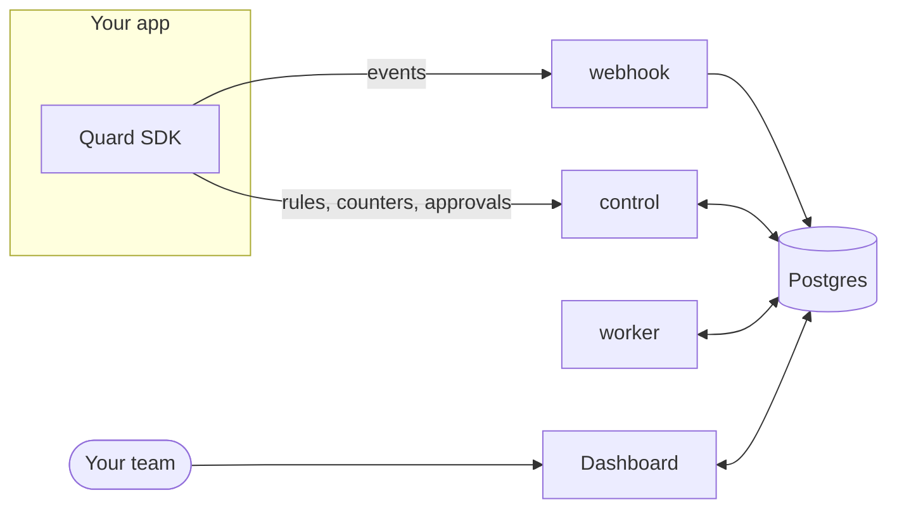

# Introduction

Quard watches AI agents while they work. It records every model call, stops dangerous actions before they run, and shows which step and which agent caused a failure.

It works for one agent and for teams of agents that delegate to each other, send messages and share memory.

## Why it exists

Agents read content they did not write: web pages, emails, files and replies from other agents. Any of it can carry instructions or values meant to steer them. A supplier page can claim the bank details have changed. A forwarded email can ask for a customer list. The agent cannot always tell, and the next tool it calls may move money or data.

Quard keeps track of where every piece of content came from. It checks each risky tool call against that, before the call runs, and asks a person when a call needs a second look.

## How it works

- **The SDK** runs inside your app. It wraps your OpenAI client and your tools, and runs its checks in your process before a tool is called.
- **The backend** stores what happened, keeps shared counters and holds approval requests until someone answers. The worker finds the cause of incidents in the background.
- **The dashboard** is where your team watches runs, answers approvals and looks into incidents. The [user guides](/guides/getting-started) cover it.

Quard is self-hosted. It runs in your own cloud with Docker and Postgres, so traces stay in your network.

## Key ideas

### Runs and steps

A run is one task from start to finish. Every model call, tool call, guard decision, approval, message and memory read or write is a step in it. When agents work together, all their steps land in the same run.

### Labels

Every piece of content gets a label that says where it came from:

- **Origin**: the tool, domain, sender, server or agent that let the content in, such as `web:supplier-portal.example` or `email:claims-desk.io`.
- **Trust**: trusted or untrusted.
- **Sensitivity**: internal or public.

The origin is a recorded fact. It never comes from the content itself or from an AI. Trust and sensitivity follow from the origin: web pages, outside email and MCP servers are untrusted by default, while your users and your own tools are trusted.

Quard also traces values. For each argument of a tool call, it lists every place the value appeared earlier in the run, across all agents. An IBAN that first showed up on a web page keeps that origin, even after it passes through another agent. A value found nowhere earlier is marked **model-generated**.

### Guards

A guard wraps a tool and checks every call to it. There are five kinds:

| Guard    | Wrap it around                                                    | What it does                                                                              |
| -------- | ----------------------------------------------------------------- | ----------------------------------------------------------------------------------------- |
| Source   | Tools that bring content in: web fetch, search, inbox, files, MCP | Labels the output and scans it for bad domains, hidden instructions and invisible text    |
| Action   | Tools that change something: payments, emails, deletes, deploys   | Checks the arguments and their labels against rules, then allows, blocks or asks a person |
| Approval | High-stakes tools                                                 | Always asks a person first                                                                |
| Egress   | Tools that send data out: email, uploads, HTTP posts              | Keeps internal data away from destinations that are not allowed                           |
| Limit    | Any tool                                                          | Caps calls, amounts and cost per run, agent or day                                        |

A blocked call never reaches the tool. The agent gets a short refusal that says what was stopped and why.

Rules live in your code. A new rule can run in **observe** mode first: it records "would block" or "would ask" but lets the call through.

### Approvals

Some calls wait for a person. The approver sees the exact arguments, where each value came from and the path that led to the call, then answers **Approve once**, **Always approve** or **Deny**. A request waits until someone answers.

### Incidents

When a guard blocks a tool call, or would have blocked it in observe mode, Quard opens an incident. It traces the path from the entry point to the damage and names the guard that was missing. When you ask, it also replays the deciding model call with and without the suspect content to confirm the cause.

### Fleet check

A new bank account, recipient or domain that suddenly shows up across many runs is a common sign of an attack. Quard watches new values and blocks one everywhere once a fifth separate run uses it within 24 hours. Blocked values wait in quarantine until someone marks them as known.

## Where to go next

- New to the dashboard? Start with [Getting started](/guides/getting-started).
- A call is waiting for you? See [Approvals](/guides/approvals).
- Looking into a failure? See [Incidents](/guides/incidents).
- Running agents that work together? See [Multi-agent](/concepts/multi-agent), [Run limits](/concepts/run-limits) and [Shared memory](/concepts/shared-memory).
- Using the OpenAI Agents SDK? See [OpenAI Agents SDK](/integrations/openai-agents).
- Want the details behind the key ideas? Read the [concepts](/concepts/labels), starting with labels and trust.
- Stuck on a word? See the [glossary](/glossary).
