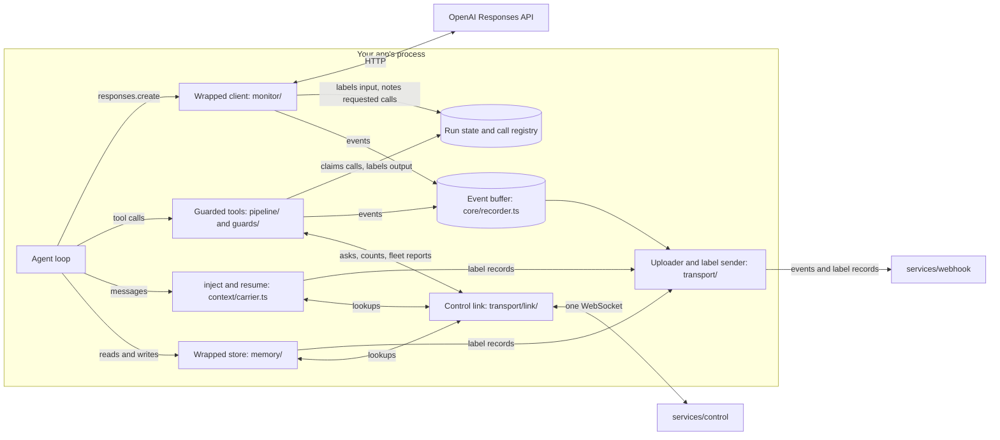

# Architecture

The SDK is the package `quard` in [`packages/sdk`](https://github.com/oynozan/quard/tree/main/packages/sdk). It runs inside your app's process. These pages are for people who read or change its code. This one covers the folder map, how data moves, and the state the SDK keeps.

## The folder map

Tests sit next to the code they test, such as `pipeline/guard.ts` and `pipeline/guard.test.ts`.

| Path                                                                                                                | What it holds                                                                                                                                                                                                                                                                              |
| ------------------------------------------------------------------------------------------------------------------- | ------------------------------------------------------------------------------------------------------------------------------------------------------------------------------------------------------------------------------------------------------------------------------------------ |
| [`index.ts`](https://github.com/oynozan/quard/blob/main/packages/sdk/index.ts)                                      | The main entry point: the `quard` object (`wrap`, `run`, `agent`, `inject`, `resume`, `toBaggage`, `configure`, `memory`), `guard()`, the refusal classes, `jevDetector()`, `DetectorError` and the exported types. `index.test.ts` pins the list of exports.                              |
| [`integrations/openai-agents/`](https://github.com/oynozan/quard/tree/main/packages/sdk/integrations/openai-agents) | The second entry point, `quard/openai-agents`: `quardRunner()` and `guardedTool()` for the OpenAI Agents SDK. See [Agents, messages and memory](/sdk/internals/multi-agent#the-openai-agents-sdk-integration).                                                                             |
| [`monitor/`](https://github.com/oynozan/quard/tree/main/packages/sdk/monitor)                                       | The wrapped client: `quard.wrap()`, the fetch hook, request and response parsing, the event stream tap, checks on the tool calls a model asks for, agent versions, and the labels of briefs and framework tools. See [The wrapped client](/sdk/internals/monitor).                         |
| [`context/`](https://github.com/oynozan/quard/tree/main/packages/sdk/context)                                       | The run context. `scope.ts` holds `quard.run()` and `quard.agent()` on `AsyncLocalStorage`, `run.ts` the state of one run, `registry.ts` the call registry, `carrier.ts` `quard.inject()` and `quard.resume()`, `baggage.ts` the baggage header, `shared-run.ts` runs that span processes. |
| [`labels/`](https://github.com/oynozan/quard/tree/main/packages/sdk/labels)                                         | The content index, value labels, the print of a message or memory item, and label records. See [Labels and value tracing](/sdk/internals/labels).                                                                                                                                          |
| [`memory/`](https://github.com/oynozan/quard/tree/main/packages/sdk/memory)                                         | `quard.memory()`: the store wrapper, reads and writes through it, and the labels this process kept for what it wrote. See [Shared memory](/sdk/internals/multi-agent#shared-memory).                                                                                                       |
| [`pipeline/`](https://github.com/oynozan/quard/tree/main/packages/sdk/pipeline)                                     | `guard()` and the steps every guarded call runs: checks, approval, counting, output, the detector and records. See [The guard pipeline](/sdk/internals/pipeline).                                                                                                                          |
| [`guards/`](https://github.com/oynozan/quard/tree/main/packages/sdk/guards)                                         | One folder per guard type (`source`, `action`, `approval`, `egress`, `limit`), plus the shared types: `call.ts` (`GuardCall`, `RuleResult`), `options.ts` and `types.ts`. `limit/` also holds the run limits.                                                                              |
| [`detectors/`](https://github.com/oynozan/quard/tree/main/packages/sdk/detectors)                                   | The `Detector` type, `DetectorError`, the labels a detector picks from, chunking, and `jev/`, the Jev detector.                                                                                                                                                                            |
| [`policy/`](https://github.com/oynozan/quard/tree/main/packages/sdk/policy)                                         | The policy file: its Zod schema (`schema.ts`), loading and live state (`state.ts`), the strictness presets (`presets.ts`), and the list and hash of active rules sent to control (`rules.ts`).                                                                                             |
| [`signatures/`](https://github.com/oynozan/quard/tree/main/packages/sdk/signatures)                                 | The attack signature feed: its schema, text cleaning, the matcher and the check on tool input.                                                                                                                                                                                             |
| [`feeds/`](https://github.com/oynozan/quard/tree/main/packages/sdk/feeds)                                           | JSON documents that can change while the app runs: a file source and a URL source. The policy file and the signature feed use them.                                                                                                                                                        |
| [`transport/`](https://github.com/oynozan/quard/tree/main/packages/sdk/transport)                                   | `configure.ts` starts and stops uploads and the link. `uploader.ts` and `prepare.ts` send events to webhook, `label-sender.ts` and `labels.ts` store and look up label records. `link/` is the WebSocket to control. See [Uploads and the control link](/sdk/internals/transport).         |
| [`core/`](https://github.com/oynozan/quard/tree/main/packages/sdk/core)                                             | The configuration and run limits (`config.ts`), the event buffer (`recorder.ts`), `GuardRefusal` and `GuardBlockedError` (`refusal.ts`), and error text (`errors.ts`).                                                                                                                     |
| [`test/`](https://github.com/oynozan/quard/tree/main/packages/sdk/test)                                             | Helpers for tests: a fake Responses API, fake sockets, stand-ins for control and webhook, Agents SDK helpers and more. Left out of coverage and of the build. See [Testing and building](/sdk/internals/testing).                                                                          |
| [`e2e/`](https://github.com/oynozan/quard/tree/main/packages/sdk/e2e)                                               | End-to-end tests through the public API, such as the payment attack, agents in two processes, shared memory and the Agents SDK.                                                                                                                                                            |
| [`examples/`](https://github.com/oynozan/quard/tree/main/packages/sdk/examples)                                     | An example policy file with its README and JSON Schema, and the starter signature feed with its schema.                                                                                                                                                                                    |

## How packages/shared fits

[`packages/shared`](https://github.com/oynozan/quard/tree/main/packages/shared) (`@quard/shared`) holds code that must behave the same in the SDK and in the services:

- event schemas and the upload batch format (`events/`)
- the messages between the SDK and control (`control/protocol.ts`), with label lookups and run counts in `control/labels.ts`
- run, step and event ids in the W3C trace format (`ids/`)
- label types, the default trust per origin, `combineLabels()`, and the label records of messages and memory items (`labels/`)
- value normalizers for IBANs, emails, URLs, hosts, file paths and ids (`normalize/`)
- value extraction, argument flattening, canonical JSON, `textOf()` and `keyText()` (`values/`)
- redaction of events and label records, the keyed hash, and each project's hash key (`redact/`)
- refusal text templates (`refusals/`)
- model prices, `usageOf()` and `costOf()` (`prices/`), and a port reader for the services (`config/`)

The SDK lists `@quard/shared` as a dev dependency, and tsdown bundles its code and types into `dist`, so users install one package. That is why shared code must hold no database or server code. It depends only on `tldts` and `zod`, which the SDK lists as its own dependencies.

The services import the same package. Webhook checks each upload against `uploadBatch` and each label upload against `labelUpload`, and redacts them again. Control reads and writes the messages in `control/protocol.ts`. Both make a project's hash key from the install's key with `projectHashKey()`.

## How data moves



1. **The model call.** Your agent loop calls the model through the wrapped client. The monitor reads the request, finds the run, checks the run limits on steps and cost, and adds what the model reads to the run's content index with its labels. It checks each tool call in the response and notes it in the call registry.
2. **The tool call.** Your loop runs the tool call through the guarded function. `guard()` claims the matching call from the registry, labels the arguments, runs the checks and decides. The tool runs only when the decision allows it. Its output is labeled and added to the content index, so the next model call sees that label.
3. **Messages and memory.** `quard.inject()` and a wrapped store's writes save a label record for what leaves the run. A receive guard, `quard.resume()` and a wrapped store's reads find that record again: in this process, or through control. See [Agents, messages and memory](/sdk/internals/multi-agent).
4. **Records.** Every step records events in the event buffer. With uploads on, the uploader sends them to webhook in batches, redacted first. Label records go to webhook at once, not in batches.
5. **The live link.** With the link on, the SDK talks to control over one WebSocket: approvals, per-day counts, fleet reports, label lookups and the counters of runs that span processes. Control sends back the project's hash key, answers, today's counts and the quarantine list. The SDK also sends its active rules and agent versions.

Steps 1 and 2 run in your process. Only a few checks need the backend: approvals asked in the dashboard, shared per-day counts, the fleet check, and labels that another process stored. Uploads and the link are optional, and start only when [`quard.configure()`](/sdk/reference/configure) gets an agent key and their URLs. The SDK then gets the project's hash key from webhook or control, and redacts with it. See [The project's hash key](/sdk/internals/transport#the-projects-hash-key).

## The state the SDK keeps

Guards run in your process, so the SDK keeps its state in module-level variables. A process has one of each.

| State           | Module                                               | What it holds                                                                                                                                     | Cleared by                                  |
| --------------- | ---------------------------------------------------- | ------------------------------------------------------------------------------------------------------------------------------------------------- | ------------------------------------------- |
| Configuration   | `core/config.ts`                                     | The merged options of every `quard.configure()` call, run limits included                                                                         | `resetConfig()`                             |
| Policy and feed | `policy/state.ts`                                    | The open policy file and signature feed, with their last good versions                                                                            | `closeSources()`, called by `resetConfig()` |
| Event buffer    | `core/recorder.ts`                                   | Up to 10,000 events not yet uploaded, how many were dropped, and the size of the request bodies they hold                                         | `takeEvents()` empties the buffer           |
| Call registry   | `context/registry.ts`                                | Tool calls the model asked for, the run behind each response id and conversation id (the newest 10,000 of each), and every guarded tool's options | `clearRegistry()`                           |
| Label records   | `labels/records.ts`                                  | The newest 10,000 records this process made for messages, and the runs that sent them, so a resume in this process rejoins the run                | `clearRecords()`                            |
| Memory labels   | `memory/kept.ts`                                     | The labels of the newest 10,000 items this process wrote to a wrapped store, by print                                                             | `clearMemory()`                             |
| Always answers  | `guards/approval/approval.ts`                        | "Always" answers from an approver set in code                                                                                                     | `clearApprovals()`                          |
| Day counts      | `guards/limit/daily.ts`                              | Per-day counts this process knows, for today and yesterday (UTC)                                                                                  | `clearDayCounts()`                          |
| Agent versions  | `monitor/versions.ts`                                | The newest 100 agent versions this process saw                                                                                                    | `clearVersions()`                           |
| Rules snapshot  | `policy/rules.ts`                                    | The last list and hash of active rules                                                                                                            | Built again when the inputs change          |
| Uploads, link   | `transport/configure.ts`, `transport/link/active.ts` | The running uploader and label sender, and the active control link                                                                                | `stopUploads()`, `stopLink()`               |
| Project key     | `core/project-key.ts`                                | The project's hash key from control's `ready` or webhook, and the calls waiting for it                                                            | `forgetProjectKey()`, or a new agent key    |
| Process key     | `labels/print.ts`, `memory/values.ts`                | Random keys made at start, for prints and value hashes while the project's hash key isn't known                                                   | Never: they last as long as the process     |

Some state is kept per run or per scope in a `WeakMap` or `WeakSet`, so it goes away with the run: the runs that span processes (`guards/limit/run-counts.ts`), what each resumed scope came in with (`context/carrier.ts`), framework tools and brief labels (`monitor/framework-tools.ts`, `monitor/agent-brief.ts`), and the Agents SDK frames and paused runs (`integrations/openai-agents/`). The first `quardRunner()` call also patches `Runner.prototype.run` and `Agent.prototype.getEnabledHandoffs` of `@openai/agents`, once per process.

Two more kinds of state are not module-level:

- **One run.** `RunState` in `context/run.ts` holds the run id, the run's `ContentIndex`, its per-run counters, the helpers each agent delegated to, the turns between each pair of agents, its model calls and its estimated cost. It lives in a `Scope`, which also names the agent, its parent step, the tools it may use, its last step and its depth. `AsyncLocalStorage` carries the scope across `await`. Registry entries point at scopes too, so a later request or tool call can join the run.
- **One link.** `createControl()` keeps the socket and its retry timer, requests waiting for replies, calls waiting for approval, the synced quarantine list, and counts and fleet reports to send again later. `Control.stop()` closes the link and ends the waiting requests and approvals. `stopLink()` calls it.

### How tests reset it

The tests in one file share these modules. So test files that touch this state call `resetAll()` from [`test/reset.ts`](https://github.com/oynozan/quard/blob/main/packages/sdk/test/reset.ts) after each test:

```ts
// Puts every module-level store back to empty between tests
export function resetAll(): void {
    resetConfig();
    takeEvents();
    clearRegistry();
    clearApprovals();
    clearRecords();
    clearMemory();
    stopUploads();
    stopLink();
    forgetProjectKey();
    clearDayCounts();
    clearVersions();
    clearChecked();
    clearPayments();
    clearHostedApprovals();
}
```

```ts
afterEach(() => {
    resetAll();
});
```

When you add module-level state, give it a clear function and call it from `resetAll()`. Otherwise one test's state leaks into the next.

## Source

- [`packages/sdk/index.ts`](https://github.com/oynozan/quard/blob/main/packages/sdk/index.ts): the main entry point
- [`packages/sdk/integrations/openai-agents/index.ts`](https://github.com/oynozan/quard/blob/main/packages/sdk/integrations/openai-agents/index.ts): the `quard/openai-agents` entry point
- [`packages/sdk/context/scope.ts`](https://github.com/oynozan/quard/blob/main/packages/sdk/context/scope.ts): `Scope`, `quard.run()` and `quard.agent()`
- [`packages/sdk/context/run.ts`](https://github.com/oynozan/quard/blob/main/packages/sdk/context/run.ts): `RunState`
- [`packages/sdk/context/registry.ts`](https://github.com/oynozan/quard/blob/main/packages/sdk/context/registry.ts): the call registry
- [`packages/sdk/core/config.ts`](https://github.com/oynozan/quard/blob/main/packages/sdk/core/config.ts): the configuration and run limits
- [`packages/sdk/core/recorder.ts`](https://github.com/oynozan/quard/blob/main/packages/sdk/core/recorder.ts): the event buffer
- [`packages/sdk/test/reset.ts`](https://github.com/oynozan/quard/blob/main/packages/sdk/test/reset.ts): `resetAll()`
- [`packages/sdk/tsdown.config.ts`](https://github.com/oynozan/quard/blob/main/packages/sdk/tsdown.config.ts): the two entry points and how shared code is bundled
- [`packages/shared/index.ts`](https://github.com/oynozan/quard/blob/main/packages/shared/index.ts): everything shared exports
- [PROJECT.md](https://github.com/oynozan/quard/blob/main/PROJECT.md): the decided design
