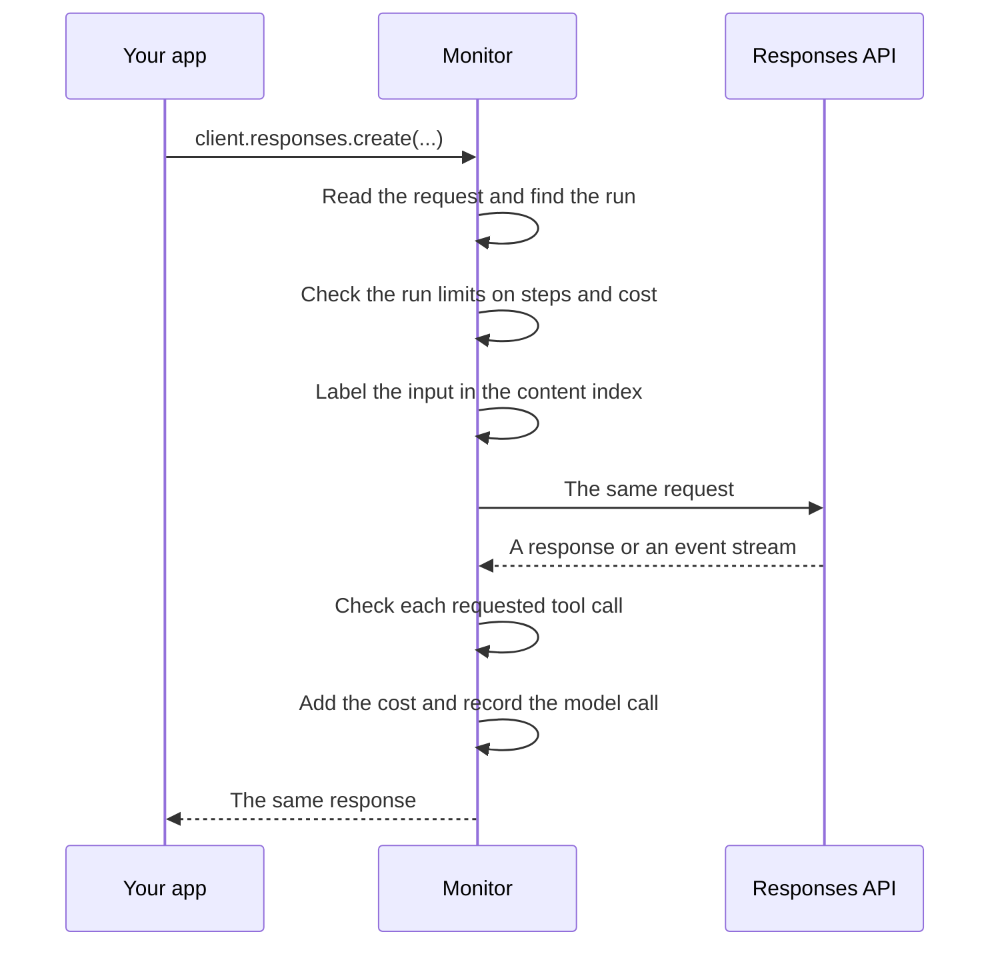

# The wrapped client

`quard.wrap(client)` returns a copy of your OpenAI client whose requests go through the monitor, `createMonitorFetch()` in [`monitor/fetch.ts`](https://github.com/oynozan/quard/blob/main/packages/sdk/monitor/fetch.ts). The monitor reads each Responses API request, checks the run limits, labels what the model reads, checks the tool calls the model asks for and records the model call. This page follows one request through that code.

## wrap()

```ts
// Returns a copy of the client whose requests go through the monitor.
// A client that already does, wrapped or copied from one, comes back
// as it is, so no call is recorded twice.
export function wrap<T extends Wrappable<T>>(client: T): T {
    const current = (client as unknown as { fetch?: Fetch }).fetch;
    if (isMonitorFetch(current)) {
        return client;
    }
    return client.withOptions({ fetch: createMonitorFetch(current ?? globalThis.fetch) });
}
```

- `withOptions()` is the OpenAI client's own way to copy itself with new options. The client you pass in stays as it was.
- The monitor sends requests on with the client's own `fetch` when it has one, else with the global `fetch`. So a custom fetch keeps working.
- Every fetch the monitor makes goes into a `WeakSet`. `isMonitorFetch()` spots it, so wrapping twice, or wrapping a copy of a wrapped client, adds no second monitor. `quardRunner()` relies on this, since it wraps the client it gets.

## One request, step by step



For each request, the fetch that `createMonitorFetch()` returns does this:

1. `readResponsesRequest()` reads the request. Anything other than a POST to a path that ends in `/responses` passes through untouched. A Responses call whose body can't be read is passed on too, and recorded as an `unreadable_request` warning.
2. `resolveScope()` finds the run the request belongs to.
3. The run limits on steps and cost are checked. A call over an enforced limit never leaves the process. Your app gets a 403 response instead. See [Run limits on model calls](#run-limits-on-model-calls).
4. `versionOf()` hashes the agent version, and `noteVersion()` tells control about a new one.
5. `labelInput()` adds what the model will read to the run's content index.
6. The model call is counted as a step, unless the run spans processes and control counted it in step 3. The request goes to the inner fetch unchanged.
7. When the fetch throws, or the response is not ok or has no body, a `model_call` event with the status `error` is recorded. The error or the response reaches your app as it was.
8. A plain response is read in full. Its tool calls are checked, its cost is added to the run, and the model call is recorded. Your app gets a new `Response` with the same text, status and headers.
9. A stream goes through `watchStream()`, which does the same work as the events arrive.

## Reading the request

`parseRequest()` in [`monitor/request.ts`](https://github.com/oynozan/quard/blob/main/packages/sdk/monitor/request.ts) turns the body into a `ResponsesRequest`:

```ts
export type ResponsesRequest = {
    model: string;
    instructions: string | undefined;
    // Function tools by name, hosted tools by type
    tools: string[];
    stream: boolean;
    previousResponseId: string | undefined;
    conversationId: string | undefined;
    texts: InputText[];
    // Tool call ids in the input, which tie it to an earlier run
    callIds: string[];
    // The body cut to what a replay resends
    replayBody: Record<string, unknown>;
};
```

- `instructions`, and messages with the role `system` or `developer`, become text with the role `system`.
- A string `input`, and messages with the role `user`, become text with the role `user`.
- A `function_call_output` item becomes text with the role `tool` and its call id. A string output goes through `keyText()` from [`packages/shared/values/text-of.ts`](https://github.com/oynozan/quard/blob/main/packages/shared/values/text-of.ts): JSON text is read as the value it holds, and values under fields named like secrets are left out, so no value key carries a secret.
- A `function_call` item only adds its call id.
- Assistant messages are the model's own words, so they are not read.
- `conversation` can be an id, or an object with an `id`.
- `replayBody` keeps only the fields a replay resends. See [The recorded request](#the-recorded-request).

The body is read without using it up: a string, bytes or a `Blob` from `init.body`, or a clone of a `Request`.

## Finding the run

```ts
function resolveScope(request: ResponsesRequest): Scope {
    const byResponse = request.previousResponseId === undefined ? undefined : findResponse(request.previousResponseId);
    const byConversation = request.conversationId === undefined ? undefined : findConversation(request.conversationId);
    const byCall = request.callIds.map((id) => findCall(id)?.scope).find((scope) => scope !== undefined);
    const linked = byResponse ?? byConversation ?? byCall;
    const current = currentScope();
    if (current === undefined) {
        return linked ?? newScope();
    }
    if (linked !== undefined && linked.run !== current.run) {
        current.run.index.absorb(linked.run.index);
    }
    return current;
}
```

- The call registry in [`context/registry.ts`](https://github.com/oynozan/quard/blob/main/packages/sdk/context/registry.ts) remembers the scope behind each response id, conversation id and requested tool call.
- Outside `quard.run()`, a request that chains to an earlier response, conversation or tool call joins that run. Anything else starts a new run under the agent `default`. So an app with one agent needs no scope.
- Inside a scope, the current scope wins. When the request chains to another run, the current run takes in that run's content index with its labels (`absorb()`), so its values keep their origins.
- With the Agents SDK, the current scope is the frame `quardRunner()` set up for the agent the framework runs. See [The OpenAI Agents SDK integration](/sdk/internals/multi-agent#the-openai-agents-sdk-integration).

## Run limits on model calls

Before a request leaves, the monitor checks the run's steps and cost against the [run limits](/concepts/run-limits):

```ts
// A call over an enforced run limit never leaves the process. A
// shared run counts its step through control while checking.
const shared = isShared(scope.run);
const modelCall = { run: scope.run, agent: scope.agent, stepId, model: request.model };
const refused = shared ? await countSharedModelCall(modelCall) : checkModelCall(modelCall);
if (refused !== undefined) {
    return refusedResponse(refused);
}
```

- `checkModelCall()` in [`guards/limit/model-limits.ts`](https://github.com/oynozan/quard/blob/main/packages/sdk/guards/limit/model-limits.ts) is over `max-steps` when the run's model calls plus this one pass `steps`, and over `max-cost` once the cost so far reaches `costUsd`. Each limit that is over is recorded as a `limit` decision, with the model as the tool.
- In observe mode the call goes ahead. The run limits start in observe mode.
- In block mode, `refusedResponse()` answers with HTTP 403, `x-should-retry: false` and an error of type `quard_blocked` whose message is the refusal text. The OpenAI client throws it as an API error and doesn't retry. When that error leaves `quard.run()`, `isBlockedError()` records the run as `blocked`.
- Otherwise `countModelCall()` adds the step after the input is labeled. Each response's cost is added by `addCost()` in [`pipeline/count/steps.ts`](https://github.com/oynozan/quard/blob/main/packages/sdk/pipeline/count/steps.ts), from the token usage and the price table in [`packages/shared/prices/models.ts`](https://github.com/oynozan/quard/blob/main/packages/shared/prices/models.ts). A model with no known price adds nothing.
- **A run that spans processes** counts its steps and cost in control. `countSharedModelCall()` sends one `run_count` for the step, with `steps` as the cap when the limits are enforced, and reads the cost total from control at the same time. Each cost is sent to control too. Without an answer in time, it counts in the process.

## Labeling what the model reads

`labelInput()` adds each text of the request to the run's content index, and records a `content` event for each new record. The label depends on where the text came from:

| Text                                            | Label and its default trust                                                      |
| ----------------------------------------------- | -------------------------------------------------------------------------------- |
| User text                                       | `user`: trusted                                                                  |
| The brief of an agent run as a tool             | `agent:<caller>`, with the trust and sensitivity of the caller's run at the call |
| Instructions and system text                    | `system`: trusted                                                                |
| The result of a tool call that `guard()` ran    | The label `guard()` stored on the call                                           |
| A handoff's result, which the Agents SDK writes | `system`: trusted                                                                |
| The result of any other tool call               | `unknown`: untrusted                                                             |
| Chained history this process never saw          | `unknown`: untrusted                                                             |

- The last row covers a `previous_response_id` or `conversation` the registry doesn't know. The monitor adds a short placeholder text with the label `unknown`, so the context label becomes untrusted.
- The brief row comes from `briefLabel()` in [`monitor/agent-brief.ts`](https://github.com/oynozan/quard/blob/main/packages/sdk/monitor/agent-brief.ts). It applies only inside a frame the Agents SDK integration marked. In a trusted brief, values the run hasn't read yet are marked made up, since the caller's model wrote them.
- Handoff results come from `unguardedOutputLabel()` in [`monitor/framework-tools.ts`](https://github.com/oynozan/quard/blob/main/packages/sdk/monitor/framework-tools.ts), for the handoffs the integration marked for that agent.

Three rules keep labels from being laundered:

- **Content seen before keeps its first label.** The same exact text read again isn't added a second time.
- **Values seen before keep their labels** (`keepEarlier`), in user text, system text and tool results that no guard labeled. When your app pastes page text into a user message, the values in it keep their web label.
- **Echoed values gain no trust** (`exclude`). A tool result that repeats values from its own arguments doesn't index them under its own label. The requested call keeps those values as `argKeys`.

When the request names a conversation, the registry remembers the scope for it. See [Labels and value tracing](/sdk/internals/labels) for the content index.

## Recording model calls

`recordModelCall()` records a `model_call` event with the run, step, agent and parent step, the model, the response id, the tool calls the model asked for, the status, the duration and the agent version. It adds the token usage when the API sent it: `usageOf()` in [`packages/shared/prices/models.ts`](https://github.com/oynozan/quard/blob/main/packages/shared/prices/models.ts) reads the input, cached and output token counts. With uploads on, it also adds the request body.

### The recorded request

The dashboard's [replay](/guides/incidents#replay) resends a model call. For that, each `model_call` event can carry `requestBody`: the request cut to the fields a replay needs.

```ts
// The body replay resends. Kept only while uploads are on, or the
// event buffer would hold it for nothing.
function requestBodyOf(step: Step): { requestBody?: Record<string, unknown> } {
    const body = step.request.replayBody;
    return uploadsOn() && JSON.stringify(body).length <= MAX_REQUEST_BODY ? { requestBody: body } : {};
}
```

- `REPLAY_FIELDS` in `monitor/request.ts` lists what is kept: `model`, `instructions`, `input`, `tools`, `tool_choice`, `parallel_tool_calls`, `temperature`, `top_p`, `reasoning`, `text`, `max_output_tokens`, `max_tool_calls`, `truncation`, `top_logprobs`, `prompt`, `previous_response_id` and `conversation`. Fields such as `stream`, `store`, `metadata`, `user` and `include` are left out.
- A body longer than 512 Ki characters as JSON (`MAX_REQUEST_BODY`) is not kept.
- In the process the body is raw. Like every event, it is redacted by `prepareEvent()` before upload. See [Redaction before upload](/sdk/internals/transport#redaction-before-upload).
- The event buffer holds at most 32 Mi characters of request bodies. Past that, the oldest buffered model calls lose theirs, and their replay is limited.

## Checking requested calls

```ts
// Checks the tool calls a model asked for, before the app receives them.
// A call that fails stays in the response, marked blocked; its guard refuses it.
export function checkRequestedCalls(calls: readonly FunctionCall[], scope: Scope, stepId: string): void {
    for (const call of calls) {
        const allowed = mayUse(scope, call.name);
        registerCall({
            callId: call.callId,
            tool: call.name,
            args: parseJson(call.arguments) ?? call.arguments,
            scope,
            stepId,
            blocked: allowed ? undefined : { guard: "permission", reason: "permission_denied" },
        });
        // ... records a "permission" decision with the rule "requested-call"
        if (warnsUnwrapped(scope, call.name)) {
            // An unwrapped tool can only be recorded, never stopped
            record({ type: "warning", ...base, code: "unwrapped_tool" });
        }
    }
}
```

- The check today is the agent's tool permission, from the tool list of its scope.
- The response is not changed. The blocked mark lives in the registry, and the guarded tool refuses the call when your app runs it. See [Context and permission](/sdk/internals/pipeline#context-and-permission).
- A tool that no `guard()` registered gets an `unwrapped_tool` warning. Handoffs and agents run as tools are the Agents SDK's own, so `warnsUnwrapped()` skips the ones the integration noted for the run.
- `registerCall()` also keeps the agent whose model asked. A handoff later changes the scope's agent, but the call keeps the agent it came from.

### How guard() claims a requested call

```ts
// guard() claims an open call with the same tool and arguments. Inside a
// run, only calls from that run count. A blocked mark always wins, and
// outside a run an unmatched blocked call for the tool still counts.
export function claimCall(tool: string, args: unknown, run?: RunState): RequestedCall | undefined {
    const key = canonicalJson(args);
    const open = [...calls.values()].filter(
        (call) => !call.claimed && call.tool === tool && (run === undefined || call.scope.run === run),
    );
    const exact = open.filter((call) => call.argsKey === key);
    const chosen =
        exact.find((call) => call.blocked !== undefined) ??
        exact[0] ??
        (run === undefined ? open.find((call) => call.blocked !== undefined) : undefined);
    if (chosen !== undefined) {
        chosen.claimed = true;
    }
    return chosen;
}
```

- Arguments match by canonical JSON from [`packages/shared/values/canonical.ts`](https://github.com/oynozan/quard/blob/main/packages/shared/values/canonical.ts), so key order doesn't matter.
- Each requested call is claimed once.
- The claimed call gives the guarded call its call id, and its run when the guarded call runs outside any scope. In return, `guard()` stores the label of the result on it as `outputLabel`, for the next request.

## Streams

`tapSse()` in [`monitor/sse.ts`](https://github.com/oynozan/quard/blob/main/packages/sdk/monitor/sse.ts) passes an event stream through unchanged. It splits the text at blank lines, shows each event to a hook, and passes the event on only when the hook is done:

```ts
const emit = async (raw: string, controller: TransformStreamDefaultController<Uint8Array>) => {
    await onEvent(parseSseEvent(raw));
    controller.enqueue(encoder.encode(raw));
};
```

`watchStream()` in `fetch.ts` is the hook:

| Event                                             | What the monitor does                                                                                        |
| ------------------------------------------------- | ------------------------------------------------------------------------------------------------------------ |
| `response.output_item.added` with a function call | Notes the item's call id and tool name                                                                       |
| `response.function_call_arguments.done`           | Checks the call with its final arguments                                                                     |
| `response.output_item.done` with a function call  | Checks the call, if it wasn't checked yet                                                                    |
| `response.completed` or `response.incomplete`     | Checks any call not checked yet, registers the response id, adds the cost and records the model call as `ok` |
| `response.failed`                                 | The same, with the status `error`                                                                            |

So the event that completes a tool call reaches your app only after the call is checked and in the registry. Each call is checked once. Every other event passes through as it arrives.

## Agent versions

```ts
// A 16-hex hash of the model, the instructions and the tool names. The
// instructions are hashed redacted, as control stores them, so the hash
// can't be used to guess what the redaction masked.
export function versionOf(model: string, instructions: string | undefined, tools: readonly string[]): string {
    const shown = instructions === undefined ? null : redactText(instructions);
    const text = canonicalJson({ model, instructions: shown, tools: [...tools].sort() });
    return createHash("sha256").update(text).digest("hex").slice(0, 16);
}
```

- Each `model_call` event carries its agent version.
- `rememberVersion()` in [`monitor/versions.ts`](https://github.com/oynozan/quard/blob/main/packages/sdk/monitor/versions.ts) returns true the first time this process sees an agent at a version, and keeps the newest 100. Only then does `noteVersion()` send an `agent` message to control.
- After each connect, control gets every known version again.

## Source

- [`packages/sdk/monitor/wrap.ts`](https://github.com/oynozan/quard/blob/main/packages/sdk/monitor/wrap.ts): `wrap()`
- [`packages/sdk/monitor/fetch.ts`](https://github.com/oynozan/quard/blob/main/packages/sdk/monitor/fetch.ts): `createMonitorFetch()`, `resolveScope()`, `labelInput()`, `watchStream()`, the recorded request
- [`packages/sdk/monitor/request.ts`](https://github.com/oynozan/quard/blob/main/packages/sdk/monitor/request.ts): reading the request, and the fields a replay keeps
- [`packages/sdk/monitor/response.ts`](https://github.com/oynozan/quard/blob/main/packages/sdk/monitor/response.ts): tool calls and the response id
- [`packages/sdk/monitor/sse.ts`](https://github.com/oynozan/quard/blob/main/packages/sdk/monitor/sse.ts): the event stream tap
- [`packages/sdk/monitor/check.ts`](https://github.com/oynozan/quard/blob/main/packages/sdk/monitor/check.ts): checks on requested calls
- [`packages/sdk/monitor/agent-brief.ts`](https://github.com/oynozan/quard/blob/main/packages/sdk/monitor/agent-brief.ts): the label of an agent tool's brief
- [`packages/sdk/monitor/framework-tools.ts`](https://github.com/oynozan/quard/blob/main/packages/sdk/monitor/framework-tools.ts): handoffs and agent tools
- [`packages/sdk/monitor/versions.ts`](https://github.com/oynozan/quard/blob/main/packages/sdk/monitor/versions.ts): agent versions
- [`packages/sdk/guards/limit/model-limits.ts`](https://github.com/oynozan/quard/blob/main/packages/sdk/guards/limit/model-limits.ts): steps and cost
- [`packages/sdk/pipeline/count/steps.ts`](https://github.com/oynozan/quard/blob/main/packages/sdk/pipeline/count/steps.ts): steps and cost of a run that spans processes
- [`packages/sdk/context/registry.ts`](https://github.com/oynozan/quard/blob/main/packages/sdk/context/registry.ts): `registerCall()`, `claimCall()`, responses and conversations
