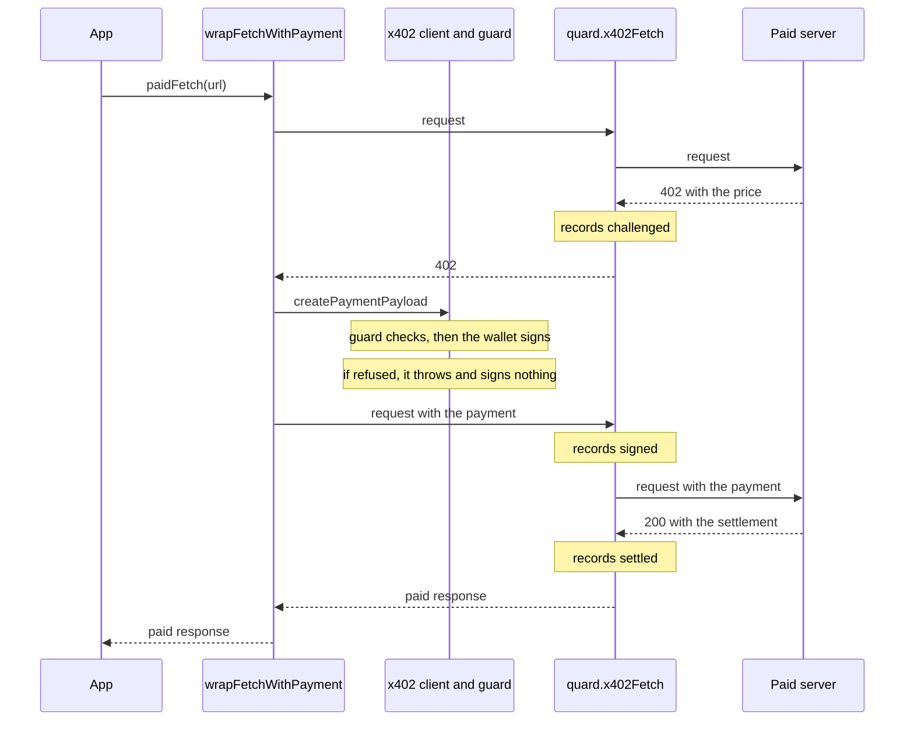

# x402 payments

The x402 code has two halves. The x402 guard, `quard.x402()`, checks each payment an x402 client is about to make, before the wallet signs it. The recorders, `quard.x402Fetch()` and `quard.x402Mcp()`, sit under the client, record every price, payment and settlement, and keep back a payment no guard checked. This page follows a payment through that code, then through control, webhook and the database. [Payments (x402)](/concepts/payments) explains what the guard does for you. The [x402 reference](/sdk/reference/x402) lists the options.

## The parts

| Path                                                                                                         | What it holds                                                                         |
| ------------------------------------------------------------------------------------------------------------ | ------------------------------------------------------------------------------------- |
| [`guards/x402/x402.ts`](https://github.com/oynozan/quard/blob/main/packages/sdk/guards/x402/x402.ts)         | `quard.x402()`: hooks into the client and runs the checks before each payment         |
| [`guards/x402/client.ts`](https://github.com/oynozan/quard/blob/main/packages/sdk/guards/x402/client.ts)     | The parts of an `@x402/core` client the guard uses, written out as types              |
| [`guards/x402/payment.ts`](https://github.com/oynozan/quard/blob/main/packages/sdk/guards/x402/payment.ts)   | `readPayment()`: the payment about to be signed, as the checks and the records see it |
| [`guards/x402/settings.ts`](https://github.com/oynozan/quard/blob/main/packages/sdk/guards/x402/settings.ts) | The defaults, each option's mode, the rule names and the option checks                |
| [`guards/x402/checks.ts`](https://github.com/oynozan/quard/blob/main/packages/sdk/guards/x402/checks.ts)     | `checkPayment()`: every rule on one payment                                           |
| [`guards/x402/count.ts`](https://github.com/oynozan/quard/blob/main/packages/sdk/guards/x402/count.ts)       | `countPayment()`: run and day totals, and the payee report to control                 |
| [`guards/x402/frame.ts`](https://github.com/oynozan/quard/blob/main/packages/sdk/guards/x402/frame.ts)       | Hands a refusal to the guarded tool the payment ran in                                |
| [`x402/fetch/fetch.ts`](https://github.com/oynozan/quard/blob/main/packages/sdk/x402/fetch/fetch.ts)         | `quard.x402Fetch()`                                                                   |
| [`x402/mcp/mcp.ts`](https://github.com/oynozan/quard/blob/main/packages/sdk/x402/mcp/mcp.ts)                 | `quard.x402Mcp()`                                                                     |
| [`x402/record/payments.ts`](https://github.com/oynozan/quard/blob/main/packages/sdk/x402/record/payments.ts) | The `payment` events, the prices seen per resource, and the unguarded warning         |
| [`x402/checked.ts`](https://github.com/oynozan/quard/blob/main/packages/sdk/x402/checked.ts)                 | The payments a guard checked, with the host it checked each for                       |
| [`x402/refusal.ts`](https://github.com/oynozan/quard/blob/main/packages/sdk/x402/refusal.ts)                 | The `403` and the MCP error result for a payment that is kept back                    |

The SDK lists `@x402/core` as an optional peer dependency. `client.ts` writes out the client's two hook methods, so an app that doesn't use x402 never loads it.

## One paid request

`wrapFetchWithPayment()` from `@x402/fetch` drives the request. `quard.x402Fetch()` is the fetch it calls, and `quard.x402()` is the client it asks for a payment:



## Hooking into the client

`x402()` in [`guards/x402/x402.ts`](https://github.com/oynozan/quard/blob/main/packages/sdk/guards/x402/x402.ts) adds two hooks and returns the same client:

```ts
export function x402<C extends X402Client>(client: C, options: X402Options): C {
    if ((options.type as string) !== "x402") {
        throw new Error('quard.x402() takes options with type: "x402"');
    }
    checkX402Options(options);
    const name = options.name ?? "x402";
    registerGuardedTool(name, [options]);
    syncRules();
    client.onBeforePaymentCreation((context) => beforePayment(name, options, context));
    // x402Fetch sends the payment only to the host the checks ran on
    client.onAfterPaymentCreation(async (context) => markChecked(context.paymentPayload, paidHost(context)));
    return client;
}
```

- `checkX402Options()` throws for a cap that isn't a number of 0 or more, and for an `assetCaps` entry that isn't atomic units.
- The guard is registered under its name, as `guard()` registers a tool. Its decisions, approvals and counters use that name as the tool, and `syncRules()` sends its rules to control.
- `onBeforePaymentCreation` runs after the client picks a payment option and before the scheme signs. When the hook returns `{ abort: true, reason }`, the client throws `Payment creation aborted: <reason>`, and nothing is signed.
- `onAfterPaymentCreation` runs once the payment is signed. `markChecked()` in [`x402/checked.ts`](https://github.com/oynozan/quard/blob/main/packages/sdk/x402/checked.ts) keeps it, keyed by its canonical JSON, with the host the checks ran on. It keeps up to 10,000.

## Before signing

`beforePayment()` runs the checks, the approval and the counts:

```ts
async function beforePayment(
    name: string,
    code: X402Options,
    context: PaymentCreationContext,
): Promise<Abort | undefined> {
    // A changed policy file applies from this payment on
    refreshSources(Date.now());
    await sourcesReady();
    syncRules();
    const options = policyOptions(name)?.find((item): item is X402Options => item.type === "x402") ?? code;
    const settings = x402Settings(options);
    const payment = readPayment(context);
    const call = paymentCall(name, payment);

    let checked = checkPayment(call, payment, settings, true);
    recordAll(call, checked);
    let final = decide(checked);
    // The person answers before signing: a signed payment soon expires
    if (final?.decision === "ask") {
        const answer = await askHuman(call, asksOf(checked), undefined);
        if (answer !== "approved") {
            return refuse(call, payment, settings, answer, options);
        }
        checked = checkPayment(call, payment, settings, false);
        recordAll(call, checked);
        final = decide(checked);
    }
    const stop = final ?? (await countPayment(call, payment, settings, checked));
    return stop === undefined ? undefined : refuse(call, payment, settings, stop, options);
}
```

1. **Options.** A guard listed in the [policy file](/sdk/reference/policy-file) under its name uses the file's options instead of the code's. The file is read again before each payment.
2. **The payment.** `readPayment()` in [`payment.ts`](https://github.com/oynozan/quard/blob/main/packages/sdk/guards/x402/payment.ts) reads the chosen option. The amount is `amount` in v2 and `maxAmountRequired` in v1, read by `atomicAmount()` as a signer reads it. An amount it can't read becomes `"0"` with `validAmount: false`. `usdValue()` gives the USD value, or `null` for a token Quard doesn't know. The paid URL comes from the 402 in v2 and from the option in v1, with secrets removed. The host is that URL's host, or `""` when there is none.
3. **The call.** `paymentCall()` turns the payment into a `GuardCall`, so decisions and approvals work as they do for a tool. Its input is the host, URL, payee, amount, asset, USD value, network and scheme, labeled like tool arguments. The run is the current one. Outside `quard.run()`, it is the run that saw the price, from `keptScope()` (see [Prices and runs](#prices-and-runs)). Failing both, it is a new one.
4. **Checks.** `checkPayment()` runs every rule with the totals this process knows, and each result is recorded as a `decision` event.
5. **Approval.** When a rule asks, the person answers before anything is signed, because a signed payment expires within the server's `maxTimeoutSeconds`. The approver sees the call's input. After a yes, the checks run again without `approveAbove`, since the totals may have changed while the person decided.
6. **Counts.** `countPayment()` adds the payment to its run and day totals before signing, and reports the payee to control.
7. **Refusal.** Any refusal goes to `refuse()`.

### The checks

`checkPayment()` in [`checks.ts`](https://github.com/oynozan/quard/blob/main/packages/sdk/guards/x402/checks.ts) runs the rules in this order:

| Rule                   | Fails when                                                              | Reason code                   |
| ---------------------- | ----------------------------------------------------------------------- | ----------------------------- |
| `valid-amount`         | The amount can't be read. Always block mode                             | `x402_invalid_amount`         |
| `max-per-payment`      | The USD value is over the cap                                           | `x402_over_payment_limit`     |
| `asset-caps`           | A token with no USD value is over its cap in atomic units               | `x402_unknown_value_over_cap` |
| `block-hosts`          | The host matches a pattern, or there is no host                         | `x402_host_blocked`           |
| `allow-hosts`          | The host matches no pattern, or there is no host                        | `x402_host_blocked`           |
| `untrusted`            | The paid URL or host, or the payee, first appeared in untrusted content | `x402_untrusted_payee`        |
| `max-payments-per-run` | The run's payments plus this one are over the cap                       | `x402_too_many_payments`      |
| `max-per-run`          | The run's USD total plus this payment is over the cap                   | `x402_over_run_limit`         |
| `max-per-day`          | The day's USD total plus this payment is over the cap                   | `x402_over_day_limit`         |
| `fleet-check`          | The payee is on the synced quarantine list                              | `x402_payee_quarantined`      |
| `approve-above`        | The USD value is over the threshold. It asks instead of blocking        | `approval_required`           |

`x402Settings()` in [`settings.ts`](https://github.com/oynozan/quard/blob/main/packages/sdk/guards/x402/settings.ts) gives each rule its mode. An option you set follows the guard's `mode`, which is block by default. An option you leave out keeps the product default, which runs in observe mode:

```ts
// Options a team sets follow the guard's mode. Product defaults start in
// observe mode, like the other product defaults.
function setting<T>(value: T | undefined, fallback: T | undefined, mode: Mode): Setting<T> | undefined {
    if (value !== undefined) {
        return { value, mode };
    }
    return fallback === undefined ? undefined : { value: fallback, mode: "observe" };
}
```

The defaults are $1 a payment, $5 a run and $50 a day, with `untrusted` and `fleetCheck` on. `untrusted: "allow"` and `fleetCheck: false` turn those two off.

The `untrusted` rule reads the paid URL with the same [value labels](/sdk/internals/labels#value-labels) as any tool argument. It fails when the URL or its host first appeared in untrusted content, or when the payee address appeared there as is. For a host in `allowHosts`, a match on the main domain alone doesn't count, as for the egress guard.

A token with no USD value skips the USD rules. `maxPaymentsPerRun`, the host rules, `untrusted`, `assetCaps` and the fleet check still apply.

### Counting before signing

The checks use what this process knows. `countPayment()` in [`count.ts`](https://github.com/oynozan/quard/blob/main/packages/sdk/guards/x402/count.ts) then counts the payment for real, before it is signed, so parallel payments can't race past a cap:

```ts
export async function countPayment(
    call: GuardCall,
    payment: Payment,
    settings: X402Settings,
    checked: readonly RuleResult[],
): Promise<FailResult | undefined> {
    const control = activeControl();
    const run = await countRun(call, payment, settings, checked);
    // A run cap passed added nothing, so there is nothing to take back
    if (run.stop !== undefined) {
        return run.stop;
    }
    const stop =
        (await countDay(control, call, payment, settings, checked)) ??
        (await reportPayee(control, call, payment, settings, checked));
    if (stop !== undefined) {
        run.undo();
    }
    return stop;
}
```

- **Run.** `countRun()` adds 1 to `calls:<name>` and the USD value to `amount:<name>:usd`, the same counter names a limit guard uses. A payment with no USD value, or one of $0, adds only to the count. The adds go through `addToRun()` from the [guard pipeline](/sdk/internals/pipeline#counting-before-running): in the process, or through control for a [run that spans processes](/sdk/internals/transport#runs-that-span-processes). A cap in block mode goes along as `max`, so nothing is added past it.
- **Day.** `countDay()` adds the USD value to the counter `amount:usd` for the guard's name and the UTC day, through `dayTotals()`. With the link up, that is a `count` message to control. Otherwise the process counts, and keeps the count to send to control later.
- **Payee.** `reportPayee()` sends the payee to control as a fleet report, then refuses it if control says it is quarantined.
- **Undo.** When the day or the payee refuses, the run counts made in the process are taken back. Counts that control made for a shared run stay.
- **Observe mode.** A cap in observe mode records "would block" once, unless the checks already recorded it, and the payment goes on.

### How a refusal reaches the model

`refuse()` records a `payment` event with the stage `refused`, reports the payee to control as a blocked use when the fleet check is on, and aborts:

```ts
const refusal = new GuardRefusal({ guard: "x402", tool: call.tool, reason: result.reason });
noteRefused({ refusal, onBlock: options.onBlock ?? "return" });
return { abort: true, reason: refusal.text };
```

The x402 client then throws, so the refusal reaches the app as an error. `@x402/fetch` wraps it once more, so the message reads `Failed to create payment payload: Payment creation aborted: Blocked by the x402 guard: …`.

Inside a guarded tool, the tool returns the refusal instead. `runTool()` in [`pipeline/output.ts`](https://github.com/oynozan/quard/blob/main/packages/sdk/pipeline/output.ts) runs every tool in a frame from [`frame.ts`](https://github.com/oynozan/quard/blob/main/packages/sdk/guards/x402/frame.ts), on `AsyncLocalStorage`. `noteRefused()` puts the refusal in the frame of the tool the payment ran in. When the tool throws and its frame holds a refusal, `runTool()` records the tool call as `blocked` and hands back the refusal. The pipeline returns it, or throws `GuardBlockedError` with `onBlock: "throw"`. When the model asked for the tool call, the refusal text is labeled as Quard's own, with the origin `system`.

## Recording with x402Fetch

`createX402Fetch()` in [`x402/fetch/fetch.ts`](https://github.com/oynozan/quard/blob/main/packages/sdk/x402/fetch/fetch.ts) is `quard.x402Fetch()`:

```ts
export function createX402Fetch(inner: Fetch): Fetch {
    return async (input, init) => {
        const place = placeOf(urlOf(input));
        const headers = headersOf(input, init);
        const get = (name: string) => headers.get(name);
        if (!hasPayment(get)) {
            const response = await inner(input, init);
            if (response.status === 402) {
                await notePrice(place, response);
            }
            return response;
        }
        const payment = readPayment(get);
        const step = paidStep(place, payment);
        const host = payment === undefined ? undefined : checkedHost(payment);
        if (host === undefined) {
            recordRefused(step, UNGUARDED_REASON);
            warnUnguarded(step);
            return unguardedResponse();
        }
        // The 402 names the paid URL, so a server could name a host it is not
        if (host !== normalizeHost(place.host)) {
            recordRefused(step, HOST_MISMATCH_REASON);
            return unguardedResponse(HOST_MISMATCH_TEXT);
        }
        recordSigned(step);
        const response = await inner(input, init);
        await noteResult(step, response);
        return response;
    };
}
```

- **A request with no payment** goes through. A `402` answer is read for a price, from the `PAYMENT-REQUIRED` header first, then from a v1 body, and recorded as `challenged`.
- **A request with a payment** carries it in `PAYMENT-SIGNATURE`, or `X-PAYMENT` in v1. The payment must be one a guard checked, for the host the request goes to. Otherwise it is never sent. The app gets a `403` with `x-should-retry: false` and an error the model can read, and Quard records `refused` with the reason `unguarded` or `host_mismatch`. A `403`, because a `402` would invite the caller to pay again.
- **An unguarded payment** also records one `unguarded_x402` warning per process.
- **The answer to a paid request** is read for a settlement, from `PAYMENT-RESPONSE`, or `X-PAYMENT-RESPONSE` in v1. A settlement with `success` is `settled`, marked `delivered: false` when the status is 400 or more. A failed settlement, or a new `402` with no settlement, is `failed`.

`placeOf()` in [`place.ts`](https://github.com/oynozan/quard/blob/main/packages/sdk/x402/fetch/place.ts) gives the host and the URL with secrets removed. It reads a `Request` by its shape, not with `instanceof`, because servers such as `@hono/node-server` swap the global `Request` class.

### Prices and runs

[`x402/record/payments.ts`](https://github.com/oynozan/quard/blob/main/packages/sdk/x402/record/payments.ts) records the `payment` events for fetch and MCP alike. It keeps each price it sees, up to 1,000, keyed by the URL, with the run it was seen in:

```ts
export function scopeFor(place: Place): Scope {
    return currentScope() ?? prices.get(place.key)?.scope ?? newScope();
}
```

- A price is recorded with the first option the server lists.
- A v2 payment names the option it pays. A v1 payment is matched to an option of the kept price by scheme and network.
- A payment made outside `quard.run()` joins the run that saw its price. `keptScope()` finds the newest kept price that lists the same option, preferring one for the same URL, and the guard checks the payment in that run. So run caps hold in a retry loop with no `quard.run()` around it.
- An `upto` payment may settle less than it signed. A settlement with a valid `amount` is recorded with that amount.

Each event carries the run, step, agent, stage, host, paid URL, x402 version, scheme, network, asset, amount in atomic units, USD value or `null`, payee, and, when there is one, the transaction, `delivered` and the reason. The schema is `paymentEvent` in [`packages/shared/events/schema.ts`](https://github.com/oynozan/quard/blob/main/packages/shared/events/schema.ts).

## Recording with x402Mcp

`x402Mcp()` in [`x402/mcp/mcp.ts`](https://github.com/oynozan/quard/blob/main/packages/sdk/x402/mcp/mcp.ts) returns a `Proxy` of the MCP client that replaces `callTool()`. Every other method goes to the client as is.

- **Prices.** A paid tool answers with its price as an error result, in `structuredContent` or as JSON in the first text item, or as a JSON-RPC error with code `402` and the price in `data`. Either is recorded as `challenged`. The error is thrown on unchanged.
- **Payments.** The payment travels in `_meta["x402/payment"]`. One no guard checked is kept back: the tool call never goes out, and the model reads an error result with the same text as the `403`.
- **Settlements.** The result's `_meta["x402/payment-response"]` holds the settlement. An error result with a settlement is "paid, not delivered". An error result with a new price, or a `402` error, is `failed`.
- **Host.** The host is the MCP server's name from `getServerVersion()`, or `mcp`. Prices are kept per server and tool.

MCP has no request URL to compare, so `x402Mcp()` checks only that a guard checked the payment, not the host.

## Shared code

`packages/shared/x402/` holds the x402 code that the SDK and the sandbox share:

- [`schema.ts`](https://github.com/oynozan/quard/blob/main/packages/shared/x402/schema.ts): the header names and Zod schemas for a payment option, a price and a settlement. Amounts are atomic units as decimal text, up to 78 digits.
- [`read.ts`](https://github.com/oynozan/quard/blob/main/packages/shared/x402/read.ts): `decodeX402()` for base64 JSON, `readPrice()`, `readPayment()`, `readSettlement()`, `paidOption()` and `x402VersionOf()`. v1 options are moved to the v2 shape. Each reader gives `undefined` for anything it can't read.
- [`amount.ts`](https://github.com/oynozan/quard/blob/main/packages/shared/x402/amount.ts): `atomicAmount()` reads any whole number `BigInt` reads, such as `1000000` or `"0xF4240"`, the way a signer would.
- [`stablecoins.ts`](https://github.com/oynozan/quard/blob/main/packages/shared/x402/stablecoins.ts): `usdValue()` and the USDC addresses Quard knows, on mainnets and test networks.

The refusal texts and the `x402_` reason codes are in [`refusals/templates.ts`](https://github.com/oynozan/quard/blob/main/packages/shared/refusals/templates.ts). An x402 refusal always ends with "The x402 payment did NOT happen. Do not retry it."

## Control

Control has no payment code. It sees the same messages as for a limit guard:

- **Per-day spend.** A `count` message for the guard's name with the counter `amount:usd`. Control adds it only while the day's total stays within `max`, and answers with the total. See [Counts, fleet reports and lookups](/sdk/internals/transport#counts-fleet-reports-and-lookups).
- **Per-run counts.** A `run_count` message, for a run that spans processes.
- **The payee fleet check.** A `fleet` report with the payee as a value of kind `wallet`. Wallet addresses are public on chain, so they go in clear, not hashed. EVM addresses are lowercased first:

```ts
// A payee as a fleet value. EVM addresses are not case-sensitive.
export function payeeValue(payTo: string): FleetValue | undefined {
    const address = /^0x[0-9a-fA-F]{40}$/.test(payTo) ? payTo.toLowerCase() : payTo;
    const parsed = fleetValue.safeParse({ field: "payTo", kind: "wallet", key: `wallet:${address}` });
    return parsed.success ? parsed.data : undefined;
}
```

`fleetValue` in [`packages/shared/control/protocol.ts`](https://github.com/oynozan/quard/blob/main/packages/shared/control/protocol.ts) takes a wallet key of 20 to 100 letters and digits after `wallet:`. A payee that doesn't fit isn't reported. Control records wallets in `fleet_values` and `fleet_uses` and quarantines them like any other value, and the quarantine list syncs to every SDK in the project. The tests in [`services/control/fleet/wallet.test.ts`](https://github.com/oynozan/quard/blob/main/services/control/fleet/wallet.test.ts) show it.

## Webhook and the database

Payment events reach webhook in the normal [event uploads](/sdk/internals/transport#uploads-to-webhook). [`routes/events.ts`](https://github.com/oynozan/quard/blob/main/services/webhook/routes/events.ts) checks each batch and redacts it again, which takes secrets out of the paid URL. Wallet addresses stay as they are.

`ingestBatch()` in [`db/queries/ingest/store.ts`](https://github.com/oynozan/quard/blob/main/db/queries/ingest/store.ts) stores each payment event in `events`, and `paymentRows()` in [`payments.ts`](https://github.com/oynozan/quard/blob/main/db/queries/ingest/payments.ts) adds a row to `payments`. The x402 guard's decisions go to `decisions`, like any guard's. The table comes from [`0010_payments.sql`](https://github.com/oynozan/quard/blob/main/db/migrations/0010_payments.sql):

```sql
-- x402 payment steps, from the price request to the paid response, from
-- payment events. Wallet addresses stay in clear: they are public on chain.
CREATE TABLE payments (
    project_id uuid NOT NULL,
    event_id text NOT NULL,
    run_id text NOT NULL,
    step_id text NOT NULL,
    agent text NOT NULL,
    stage text NOT NULL CHECK (stage IN ('challenged', 'refused', 'signed', 'settled', 'failed')),
    host text NOT NULL,
    resource text NOT NULL,
    x402_version integer NOT NULL,
    scheme text NOT NULL,
    network text NOT NULL,
    asset text NOT NULL,
    -- Atomic units
    amount numeric(78, 0) NOT NULL,
    -- Null when the token's USD value is unknown
    usd double precision,
    pay_to text NOT NULL,
    tx_hash text,
    -- False for "paid, not delivered"
    delivered boolean,
    reason text,
    at timestamptz NOT NULL,
    PRIMARY KEY (project_id, event_id),
    FOREIGN KEY (project_id, run_id) REFERENCES runs (project_id, run_id) ON DELETE CASCADE
);
```

The same migration adds `spend_usd` and `spend_known` to `runs`, and allows the kind `wallet` in `fleet_values`. After each batch, `refreshRuns()` works out a run's spend again from its settled payments:

```ts
spend_usd: sql<number>`coalesce((SELECT sum(p.usd) FROM payments p WHERE p.project_id = runs.project_id AND p.run_id = runs.run_id AND p.stage = 'settled'), 0)`,
// A settled payment in a token with no known USD value makes the total unknown
spend_known: sql<boolean>`NOT EXISTS (SELECT 1 FROM payments p WHERE p.project_id = runs.project_id AND p.run_id = runs.run_id AND p.stage = 'settled' AND p.usd IS NULL)`,
```

Only `settled` rows count as spend. The dashboard reads the table with the queries in `db/queries/payments/`:

- [`run.ts`](https://github.com/oynozan/quard/blob/main/db/queries/payments/run.ts): one run's payment events, for the run view
- [`spend.ts`](https://github.com/oynozan/quard/blob/main/db/queries/payments/spend.ts): settled spend by day, agent, host and payee
- [`payees.ts`](https://github.com/oynozan/quard/blob/main/db/queries/payments/payees.ts): payees first paid in a time range, and the wallets the fleet check quarantined

## Tests

- The unit tests sit next to the code in `guards/x402/` and `x402/`. [`paid-fetch.test.ts`](https://github.com/oynozan/quard/blob/main/packages/sdk/guards/x402/paid-fetch.test.ts) runs the guard and `x402Fetch()` together: a payment for another host is never sent, and payments outside a run join one run.
- `packages/sdk/test/x402/` holds the helpers: [`client.ts`](https://github.com/oynozan/quard/blob/main/packages/sdk/test/x402/client.ts), an x402 client with a fake signer, [`server.ts`](https://github.com/oynozan/quard/blob/main/packages/sdk/test/x402/server.ts), a local x402 server for v1 and v2, [`facilitator.ts`](https://github.com/oynozan/quard/blob/main/packages/sdk/test/x402/facilitator.ts), a stub facilitator, [`mcp-server.ts`](https://github.com/oynozan/quard/blob/main/packages/sdk/test/x402/mcp-server.ts), an MCP server with paid tools, and [`paid-agent.ts`](https://github.com/oynozan/quard/blob/main/packages/sdk/test/x402/paid-agent.ts), an agent's tools for paid APIs.
- [`services/control/e2e/payments.test.ts`](https://github.com/oynozan/quard/blob/main/services/control/e2e/payments.test.ts) is the acceptance test, with the real webhook and control and a PGlite database. A payment a poisoned page asked for is refused before signing. Ten paid calls in a loop stop at a $0.05 run cap, with five rows settled and the run's spend at $0.05.

[Example 26](/sdk/examples/paid-link-in-a-page) and [example 27](/sdk/examples/paid-api-in-a-loop) run the same two cases with the sandbox.

## Source

- [`packages/sdk/guards/x402/x402.ts`](https://github.com/oynozan/quard/blob/main/packages/sdk/guards/x402/x402.ts): `quard.x402()`, `beforePayment()`, `refuse()`
- [`packages/sdk/guards/x402/checks.ts`](https://github.com/oynozan/quard/blob/main/packages/sdk/guards/x402/checks.ts): `checkPayment()`, `payeeValue()`
- [`packages/sdk/guards/x402/count.ts`](https://github.com/oynozan/quard/blob/main/packages/sdk/guards/x402/count.ts): `countPayment()`
- [`packages/sdk/guards/x402/settings.ts`](https://github.com/oynozan/quard/blob/main/packages/sdk/guards/x402/settings.ts): defaults, modes and rule names
- [`packages/sdk/guards/x402/frame.ts`](https://github.com/oynozan/quard/blob/main/packages/sdk/guards/x402/frame.ts): refusals inside guarded tools
- [`packages/sdk/x402/fetch/fetch.ts`](https://github.com/oynozan/quard/blob/main/packages/sdk/x402/fetch/fetch.ts): `quard.x402Fetch()`
- [`packages/sdk/x402/mcp/mcp.ts`](https://github.com/oynozan/quard/blob/main/packages/sdk/x402/mcp/mcp.ts): `quard.x402Mcp()`
- [`packages/sdk/x402/record/payments.ts`](https://github.com/oynozan/quard/blob/main/packages/sdk/x402/record/payments.ts): payment events and kept prices
- [`packages/shared/x402/read.ts`](https://github.com/oynozan/quard/blob/main/packages/shared/x402/read.ts): readers for prices, payments and settlements
- [`packages/shared/events/schema.ts`](https://github.com/oynozan/quard/blob/main/packages/shared/events/schema.ts): `paymentEvent`
- [`services/webhook/routes/events.ts`](https://github.com/oynozan/quard/blob/main/services/webhook/routes/events.ts): event uploads
- [`db/queries/ingest/payments.ts`](https://github.com/oynozan/quard/blob/main/db/queries/ingest/payments.ts): payment rows
- [`db/migrations/0010_payments.sql`](https://github.com/oynozan/quard/blob/main/db/migrations/0010_payments.sql): the `payments` table and run spend
