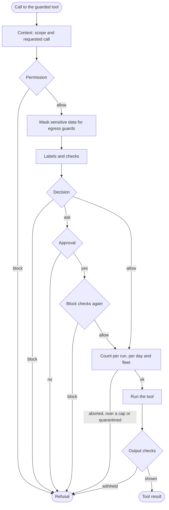

import { Steps } from "nextra/components";

# The guard pipeline

`guard()` wraps a tool function. Every call to the wrapped function runs `runPipeline()` in [`pipeline/guard.ts`](https://github.com/oynozan/quard/blob/main/packages/sdk/pipeline/guard.ts). This page maps the nine steps from [Guards](/concepts/guards#what-happens-on-every-call) to the code, and shows how to add a rule.

## What guard() does

When you wrap a tool, `guard()` checks the options and registers the tool. The work happens in `guardWithSignal()`, which gives each call an optional abort signal. `guard()` calls it with no signal:

```ts
export function guard<F extends (...args: never[]) => unknown>(
    fn: F,
    options: GuardOptions | GuardOptions[],
): (...args: Parameters<F>) => Promise<Awaited<ReturnType<F>> | GuardRefusal> {
    const guarded = guardWithSignal(fn, options);
    return (...args) => guarded(undefined, args);
}
```

`guardWithSignal()` does the checks once, when you wrap the tool:

- Each option must have a known `type`, and an approval `timeout` must be a positive number of seconds. Otherwise it throws.
- `name` is required, because it is the tool name the model sees. The first option that sets it wins.
- `registerGuardedTool()` stores the tool and its options from code in the call registry. `syncRules()` then sends the new list of rules to control, if the link is up.

`guardedTool()` from `quard/openai-agents` calls `guardWithSignal()` with the signal the Agents SDK passes to each tool call. See [Aborted calls](#aborted-calls).

## The steps in code

| Step             | In `runPipeline()`                                                     | What happens                                                                                                                     |
| ---------------- | ---------------------------------------------------------------------- | -------------------------------------------------------------------------------------------------------------------------------- |
| Before the steps | `refreshSources()`, `sourcesReady()`, `syncRules()`, `policyOptions()` | A changed policy file or signature feed applies from this call on. A tool listed in the policy file uses the file's options.     |
| 1. Context       | `currentScope()`, `claimCall()`, `newScope()`                          | The current scope, else the run of the tool call the model asked for, else a new run. The call gets a new step id.               |
| 2. Permission    | `permission()`                                                         | Blocks a call the monitor marked blocked, and a tool the agent may not use.                                                      |
| Masking          | `maskArgs()`                                                           | Egress guards that mask secrets, card numbers or IBANs replace them before the checks, the approver and the tool see them.       |
| 3. Labels        | `buildCall()`                                                          | The context label, the value labels of each argument, and the scope's delegation depth.                                          |
| 4. Checks        | `preChecks()`                                                          | Signature, limit, action, egress and approval checks, in that order.                                                             |
| 5. Decision      | `decide()`                                                             | The strictest enforced result wins.                                                                                              |
| 6. Approval      | `askHuman()`, then `preChecks()` again                                 | On ask, a person answers. Then the block checks run again.                                                                       |
| 7. Run           | `callAborted()`, `countCall()`, `runTool()`                            | A call its caller gave up on stops here. Otherwise the call is counted, then the tool runs with the checked arguments.           |
| 8. Output        | `finishOutput()`                                                       | The result is labeled, scanned and added to the content index. A message from another agent brings the labels its sender stored. |
| 9. Record        | `recordDecision()`, `recordToolCall()`                                 | Each step records its events as it goes.                                                                                         |



## One copy of the arguments

```ts
// A call its caller already gave up on is not checked at all
signal?.throwIfAborted();
// One copy of the arguments is used for checks, approval and the run
let runArgs = snapshot(args);
let input = inputOf(runArgs);
```

- `snapshot()` in [`pipeline/snapshot.ts`](https://github.com/oynozan/quard/blob/main/packages/sdk/pipeline/snapshot.ts) copies the arguments with `structuredClone()` when they are plain data: primitives, arrays and plain objects. The caller can't change the copy between the checks and the run.
- When the arguments hold anything else, such as a class instance or a function, they are passed on as they are, without a copy. For them, `changed()` compares the canonical JSON of the arguments with what the person approved. It runs after the approval and again after counting, and refuses with `approval_required` when they differ.
- `inputOf()` checks one argument as itself, and several as a list.

## Context and permission

```ts
// 1. Context: the current scope, or the run of the call the model asked for
const current = currentScope();
const requested = claimCall(spec.tool, input, current?.run);
const scope = current ?? requested?.scope ?? newScope();
const stepId = newStepId();
scope.lastStepId = stepId;
let call = buildCall(spec.tool, input, scope, stepId);
```

- `claimCall()` finds the tool call the model asked for with the same tool and arguments, and marks it claimed. See [How guard() claims a requested call](/sdk/internals/monitor#how-guard-claims-a-requested-call).
- Outside any scope, the call joins the run of the requested call it claimed. With no such call, `newScope()` starts a new run under the agent `default`, which may use every guarded tool.
- `permission()` blocks when the monitor marked the requested call blocked, with the reason the monitor gave. It also blocks when `mayUse()` says the agent may not use this tool. `quard.agent()` and `quard.resume()` build an agent's tool list with `narrowTools()`, which can only remove tools from the list above it.

The result is recorded as a decision with guard and rule `permission`.

## Masking

`maskArgs()` in [`guards/egress/payload.ts`](https://github.com/oynozan/quard/blob/main/packages/sdk/guards/egress/payload.ts) runs before the checks. It looks at every egress guard in block mode, and at what each one does with secrets, card numbers and IBANs. That comes from the guard's `payload` option, else from the policy file's strictness preset in [`policy/presets.ts`](https://github.com/oynozan/quard/blob/main/packages/sdk/policy/presets.ts).

When it masks something, the masked copy replaces the arguments, `buildCall()` runs again, and an `egress` decision with rule `payload:mask` and decision `strip` is recorded. From then on, the checks, the approver and the tool all see the masked data.

## Labels: buildCall()

```ts
function buildCall(tool: string, input: unknown, scope: Scope, stepId: string): GuardCall {
    return {
        tool,
        input,
        agent: scope.agent,
        runId: scope.run.runId,
        stepId,
        context: scope.run.index.context(),
        values: labelArguments(input, scope.run.index),
        run: scope.run,
        depth: scope.depth,
    };
}
```

A `GuardCall` from [`guards/call.ts`](https://github.com/oynozan/quard/blob/main/packages/sdk/guards/call.ts) is everything a guard sees about one call. `context` is the [context label](/concepts/labels#the-context-label) of everything the run has read. `values` lists every traceable value in each argument and where it appeared before. See [Labels and value tracing](/sdk/internals/labels). `depth` counts the delegation levels below the agent that started the run, for the depth limit.

`buildCall()` runs once the scope is known, again after masking, and again after an approval, since the run may have read more while the call waited.

## Checks: preChecks()

```ts
// The guards that act before a call, in pipeline order
export function preChecks(call: GuardCall, list: readonly GuardOptions[], withApproval: boolean): RuleResult[] {
    const results: RuleResult[] = checkSignatureInput(call);
    const fleet = activeControl()?.fleet;
    for (const options of list) {
        if (options.type === "limit") {
            results.push(...checkLimit(call, options, fleet));
        }
    }
    // ... the same for action, then egress
    if (withApproval && list.some((options) => options.type === "approval")) {
        results.push(...checkApproval());
    }
    return results;
}
```

Each check returns a `RuleResult` per rule, with `guard`, `rule`, `decision` (`allow`, `block` or `ask`) and `mode`. A block or an ask also has a `reason` code and maybe a `field`. The order is fixed:

1. `checkSignatureInput()` in [`signatures/check.ts`](https://github.com/oynozan/quard/blob/main/packages/sdk/signatures/check.ts) matches the arguments against the signature feed. While a feed is set but no version of it has loaded, it blocks every call with `signatures_unavailable`, unless the feed is in observe mode.
2. `checkLimit()` in [`guards/limit/limit.ts`](https://github.com/oynozan/quard/blob/main/packages/sdk/guards/limit/limit.ts) checks per-run counts, per-day counts as this process knows them, and the fleet check against the synced quarantine list. With `delegateTo`, it also checks the delegation limits. It only reads counts.
3. `checkAction()` in [`guards/action/action.ts`](https://github.com/oynozan/quard/blob/main/packages/sdk/guards/action/action.ts) runs the `from`, `max`, `neverSeen` and custom rules.
4. `checkEgress()` in [`guards/egress/egress.ts`](https://github.com/oynozan/quard/blob/main/packages/sdk/guards/egress/egress.ts) checks for destinations from untrusted content, internal data headed outside the allowlist, and sensitive data in what is sent.
5. `checkApproval()` in [`guards/approval/approval.ts`](https://github.com/oynozan/quard/blob/main/packages/sdk/guards/approval/approval.ts) always asks.

The source guard has no check here. It acts on the output. `runPipeline()` records every result with `recordDecision()`, allows and observe-mode results included.

### Delegation limits

A limit guard with `delegateTo` names the argument that holds the receiving agent. `checkDelegation()` in [`guards/limit/delegation.ts`](https://github.com/oynozan/quard/blob/main/packages/sdk/guards/limit/delegation.ts) checks three [run limits](/concepts/run-limits) against the run's state:

| Rule          | Blocks when                                                                | Read from          |
| ------------- | -------------------------------------------------------------------------- | ------------------ |
| `max-depth`   | The call's depth plus one is over `depth`                                  | `GuardCall.depth`  |
| `max-fan-out` | The agent would have more distinct helpers than `fanOut`                   | `RunState.helpers` |
| `max-loops`   | The turns back and forth between the two agents would be more than `loops` | `RunState.turns`   |

- Without a target in the arguments, only depth is checked.
- These rules take their mode from the run limits (`runLimits()` in [`core/config.ts`](https://github.com/oynozan/quard/blob/main/packages/sdk/core/config.ts)), not from the guard. The run limits start in observe mode.
- `countDelegation()` notes the helper and the turn when the call is counted, and returns a function that takes them back.
- Fan-out and loop counts stay in the process. They are never sent to control.

Steps and cost are the other two run limits. The wrapped client checks them before each model call. See [Run limits on model calls](/sdk/internals/monitor#run-limits-on-model-calls).

## The decision: decide()

```ts
// The strictest result wins: block, then ask, then allow.
// Rules in observe mode never change the decision.
export function decide(results: readonly RuleResult[]): FailResult | undefined {
    const enforced = results.filter(
        (result): result is FailResult => result.mode === "block" && result.decision !== "allow",
    );
    return enforced.find((result) => result.decision === "block") ?? enforced[0];
}
```

- Only results in block mode count. A result in observe mode is recorded with `enforced: false`, as "would block" or "would ask", and never changes the decision.
- Any block wins over any ask. With several blocks, the first in check order names the refusal.
- `undefined` means the call is allowed.

See [Block mode and observe mode](/concepts/guards#block-mode-and-observe-mode) for what each mode is for.

## Approval

On ask, `askHuman()` in [`pipeline/approval/human.ts`](https://github.com/oynozan/quard/blob/main/packages/sdk/pipeline/approval/human.ts) picks who answers:

| Who answers                         | When                                       | Code                                    |
| ----------------------------------- | ------------------------------------------ | --------------------------------------- |
| The `approver` function set in code | `quard.configure({ approver })` was called | `askApprover()` in `approval/local.ts`  |
| A person in the dashboard           | The control link is configured             | `askControl()` in `approval/remote.ts`  |
| Nobody                              | Neither is set                             | Blocked at once: `approval_unavailable` |

- `askApprover()` first looks for an in-process "always" answer for the same agent, tool and canonical arguments (`approvalKey()`). Only `"once"` and `"always"` approve. An approver that throws blocks with `approval_unavailable`, and the approval guard's `timeout` blocks with `approval_timed_out`.
- `askControl()` builds the ask with `askFor()` in `approval/message.ts`. The approver sees the real argument values with secrets removed, where each value came from, the context label and the rules that asked. The keyed hash of the arguments covers secrets too. Arguments nested too deep to show in full, and asks too large for the link, are refused with `approval_unavailable`. It sends the ask, flushes uploads so the approver can find the run in the dashboard, and waits. See [Approvals](/sdk/internals/transport#approvals) on the link.
- When the call's signal aborts, both stop waiting. The dashboard ask gets a `cancel`. The call is refused with `approval_timed_out` and the rule `aborted`.
- Every answer is recorded as an `approval` decision by `approval/record.ts`. The rule says what happened: `human`, `always-approved`, `timeout`, `aborted`, `backend-down`, `approver-error`, `no-approver`, `unsendable`, `too-deep-to-show` or `arguments-changed`. When control answered, `request` holds the approval request id.

After a yes, the block checks run again:

```ts
call = buildCall(spec.tool, input, scope, stepId);
checked = preChecks(call, spec.list, false);
checked.forEach((result) => recordDecision(call, result));
final = decide(checked);
// The human already said yes to every other ask
final = final?.decision === "block" ? final : undefined;
```

So an approval never overrides a block that came up while the call waited, such as a per-day cap that other calls reached. The other asks count as settled, and `withApproval` is `false`, so the approval guard doesn't ask again. See [Checks after an approval](/concepts/approvals#checks-after-an-approval).

## Counting before running

```ts
// 7. Count, then run inside the scope so calls made by the tool join
// this run. A call its caller gave up on is not counted.
const after = () => changed(call, approvedArgs) ?? callAborted(call, signal);
const stop = callAborted(call, signal) ?? (await countCall(call, spec.list, checked, after));
if (stop !== undefined) {
    return refuse(spec, call, requested, stop);
}
const ran = call;
const output = await withScope(scope, () => runTool(spec.fn, runArgs, ran, requested));
```

`countCall()` in [`pipeline/count/count.ts`](https://github.com/oynozan/quard/blob/main/packages/sdk/pipeline/count/count.ts) adds the call to its counts before the tool runs:

1. **Per run.** `countLimit()` adds to the run's counters right away. There is no `await` between the last check and this count, so parallel calls can't race past a per-run cap. It also notes delegation.
2. **Per run, shared.** When the run spans processes, its per-run counters live in control instead. `countRuns()` in `count/runs.ts` sends one `run_count` with the smallest enforced cap of each counter, and control adds all of them or none. Without an answer in time, the call counts in the process and the count waits to be sent. `countLimit()` then only notes delegation.
3. **Per day.** `countDays()` in `count/days.ts` asks control to count when the link is ready. It counts in the process when the link is down, or when control doesn't answer in time. Two limit guards on one tool add to a shared counter once, and control gets the smallest enforced cap as `max`.
4. **Fleet.** `reportUse()` in `count/fleet.ts` reports the watched values to control, and refuses a value that control has just quarantined.
5. **After.** `after()` checks again that the arguments didn't change and that the call wasn't aborted while it was counted.

When one of them refuses, the per-run counts in the process are taken back, and so are the per-day counts, with an `uncount` message when control made them. Counts that control made for a shared run stay counted. Otherwise `runTool()` in [`pipeline/output.ts`](https://github.com/oynozan/quard/blob/main/packages/sdk/pipeline/output.ts) runs the tool inside the scope, so the model calls and guarded calls it makes join this run. It records a `tool_call` event with the status `ok` or `error`. An error thrown by the tool is re-thrown unchanged.

## Aborted calls

`guardedTool()` passes the Agents SDK's abort signal for each call. The SDK aborts it on the tool's timeout, when the app aborts the run, or when a sibling call fails. The pipeline checks it in three places:

| When                       | What happens                                                                                       |
| -------------------------- | -------------------------------------------------------------------------------------------------- |
| Before any step            | `signal.throwIfAborted()` throws the signal's reason. Nothing is checked or recorded.              |
| While waiting for approval | The wait stops, and the call is refused with `approval_timed_out` and the rule `aborted`.          |
| Before and after counting  | `callAborted()` in `pipeline/abort.ts` refuses with `call_aborted`, and the counts are taken back. |

`callAborted()` records the result as a decision with the guard `abort` and the rule `aborted`:

```ts
// A call whose caller gave up, such as on the SDK's tool timeout, never
// runs. It is not an approval that timed out: the tool may have none.
export function callAborted(call: GuardCall, signal: AbortSignal | undefined): FailResult | undefined {
    if (signal?.aborted !== true) {
        return undefined;
    }
    const result: FailResult = {
        guard: "abort",
        rule: "aborted",
        decision: "block",
        mode: "block",
        reason: "call_aborted",
    };
    recordDecision(call, result);
    return result;
}
```

Once the tool has started, the signal no longer stops anything in the pipeline. The tool's own `execute` still gets it.

## Output

`finishOutput()` in [`pipeline/output.ts`](https://github.com/oynozan/quard/blob/main/packages/sdk/pipeline/output.ts) runs after the tool returns, before the agent sees the result:

- **Without a source guard**, the output gets the label `tool:<name>` and goes into the content index.
- **With a source guard**, `checkSource()` labels the output with its origin, checks the domain and scans the text. The decision is `pass`, `strip`, `flag` or `block`. A guard with no `onSuspect` uses the policy file's strictness preset. Then `signContent()` in [`pipeline/content.ts`](https://github.com/oynozan/quard/blob/main/packages/sdk/pipeline/content.ts) checks the output against the signature feed, and `detectContent()` in [`pipeline/detect/detect.ts`](https://github.com/oynozan/quard/blob/main/packages/sdk/pipeline/detect/detect.ts) asks the [detector](/sdk/reference/detector), if one is set and the content is public. What is left goes into the content index with its label and flags.
- **With a source guard whose origin is `"agent"`**, `received()` first finds the message's carrier and label record, and `receiveMessage()` decides the origin and label. A `message` event records the edge from the sender. See [The receive guard](/sdk/internals/multi-agent#the-receive-guard).

When a block is enforced, the output is withheld, and the agent gets a refusal with the reason `content_blocked`. The label is also stored on the requested call as `outputLabel`, so the monitor gives the same label to the result when your app sends it back to the model. See [How tool output is labeled](/sdk/internals/labels#how-tool-output-is-labeled).

## Records

Each step records as it goes. `recordDecision()` in [`pipeline/checks.ts`](https://github.com/oynozan/quard/blob/main/packages/sdk/pipeline/checks.ts) turns a result into a `decision` event:

```ts
export function recordDecision(call: GuardCall, result: Outcome): void {
    record({
        type: "decision",
        // ... run, step, agent, time and tool
        guard: result.guard,
        rule: result.rule,
        decision: result.decision,
        mode: result.mode,
        enforced: result.mode === "block",
        reason: result.reason,
        field: result.field,
        score: result.score,
        policy: policyVersion(),
        rules: rulesHash(),
        request: result.request,
    });
}
```

`policy` is the version of the policy file in force. `rules` is the hash of the active rules, the same hash control gets. `recordToolCall()` records each `tool_call` with `influenced` (the context label is untrusted) and `flagged`. See [Events](/sdk/reference/events) for every field.

## How a call is refused

Every stop goes through `refuse()`:

```ts
function refuse(
    spec: Spec,
    call: GuardCall,
    requested: RequestedCall | undefined,
    result: FailResult,
    ran = false,
): GuardRefusal {
    recordToolCall(call, requested, "blocked", Date.now());
    if (!ran) {
        reportRefused(call, spec.list);
    }
    if (requested !== undefined) {
        // The refusal text the app sends back is ours, not outside content
        requested.outputLabel = labelFor("system", getConfig().origins);
    }
    const refused = new GuardRefusal({
        guard: result.guard,
        tool: spec.tool,
        reason: result.reason,
        field: result.field,
    });
    const onBlock =
        spec.list.find((item) => item.type === result.guard)?.onBlock ??
        spec.list.find((item) => item.onBlock !== undefined)?.onBlock;
    if (onBlock === "throw") {
        throw new GuardBlockedError(refused);
    }
    return refused;
}
```

- A `tool_call` event with the status `blocked` is recorded.
- A refused call still counts as a use of its fleet-watched values. `reportRefused()` sends them to control, marked `blocked`.
- The refusal text gets the label `system`, since Quard wrote it.
- `GuardRefusal` in [`core/refusal.ts`](https://github.com/oynozan/quard/blob/main/packages/sdk/core/refusal.ts) takes its text from the fixed templates in [`packages/shared/refusals/templates.ts`](https://github.com/oynozan/quard/blob/main/packages/shared/refusals/templates.ts). The text names the guard, the reason and the tool. It never quotes values or content.
- `onBlock` comes from the options of the guard type that blocked, else from the first options that set it. With `"throw"`, the call throws `GuardBlockedError`. If that error leaves `quard.run()`, the run is recorded as `blocked`.

See [Refusals](/sdk/reference/refusals) for the classes and every reason code.

## Add a rule to a guard

This walkthrough adds a rule to the limit guard. The other guards work the same way.

<Steps>

### Add the option

Add the option to the guard's type in [`guards/options.ts`](https://github.com/oynozan/quard/blob/main/packages/sdk/guards/options.ts), such as `LimitOptions`.

### Check it in the guard

Return one `RuleResult` for the rule from the guard's check function, such as `checkRun()` in `guards/limit/limit.ts`. Take the mode from `options.mode ?? "block"`. Give the rule a stable name, because decision events, the rules list and the dashboard all use it. The limit guard builds its results with `limitResult()` in `guards/limit/result.ts`:

```ts
export function limitResult(rule: string, mode: Mode, over: boolean): RuleResult {
    return over
        ? { guard: "limit", rule, decision: "block", mode, reason: "limit_reached" }
        : { guard: "limit", rule, decision: "allow", mode };
}
```

Checks only read state. If the rule needs a count, add it in `countLimit()`, which returns a function that takes the count back. For a per-run count, also add it to `runCounts()` in `guards/limit/run-counts.ts`, so a run that spans processes counts it in control.

### Add a reason code, if you need one

A block or an ask needs a reason code. Codes and their refusal text live in [`packages/shared/refusals/templates.ts`](https://github.com/oynozan/quard/blob/main/packages/shared/refusals/templates.ts): add the code to `ReasonCode` and a sentence to `REASONS`. The text may name the field, but never a value or any content.

### List the rule

[`policy/rules.ts`](https://github.com/oynozan/quard/blob/main/packages/sdk/policy/rules.ts) builds the list of active rules from each guard's rule names. Add the new name where those names come from: `limitRules()` in `guards/limit/limit.ts` for a limit rule, `EGRESS_RULES` in `policy/rules.ts` for an egress rule, or `ruleName()` in `guards/action/action.ts` for an action rule. A rule that follows the run limits goes in `RUN_LIMIT_RULES`, listed once for the whole run under the tool `*`. Control and the dashboard show this list, and its hash goes on every decision.

### Allow it in the policy file

Add the option to the guard's `strictObject` in [`policy/schema.ts`](https://github.com/oynozan/quard/blob/main/packages/sdk/policy/schema.ts). Regenerate the JSON Schema with `pnpm --filter quard schemas`, and describe the option in `examples/policy/README.md`. Skip this step for options that are functions.

### Test it

Write a unit test next to the guard with `makeCall()` from `test/call.ts`, and a test through `guard()` for the whole pipeline. Coverage must stay at 100%.

```ts
it("allows calls until the per-run count is reached", () => {
    const options = { type: "limit" as const, maxCallsPerRun: 2 };
    const call = makeCall({});

    expect(checkLimit(call, options)[0]?.decision).toBe("allow");
    countLimit(call, options);
    countLimit(call, options);

    expect(checkLimit(call, options)).toEqual([
        { guard: "limit", rule: "max-calls-per-run", decision: "block", mode: "block", reason: "limit_reached" },
    ]);
});
```

</Steps>

A new guard type touches more places: `GUARD_TYPES` in `guards/types.ts`, the `GuardOptions` union, `preChecks()` or `finishOutput()`, `ruleNames()` in `policy/rules.ts`, and the union in the policy schema.

## Source

- [`packages/sdk/pipeline/guard.ts`](https://github.com/oynozan/quard/blob/main/packages/sdk/pipeline/guard.ts): `guard()`, `guardWithSignal()`, `runPipeline()`, `refuse()`
- [`packages/sdk/pipeline/checks.ts`](https://github.com/oynozan/quard/blob/main/packages/sdk/pipeline/checks.ts): `preChecks()`, `decide()`, `recordDecision()`
- [`packages/sdk/pipeline/abort.ts`](https://github.com/oynozan/quard/blob/main/packages/sdk/pipeline/abort.ts): `callAborted()`
- [`packages/sdk/pipeline/approval`](https://github.com/oynozan/quard/tree/main/packages/sdk/pipeline/approval): `askHuman()`, the approver in code, asks through control
- [`packages/sdk/pipeline/count`](https://github.com/oynozan/quard/tree/main/packages/sdk/pipeline/count): per-run, shared-run, per-day and fleet counting
- [`packages/sdk/pipeline/output.ts`](https://github.com/oynozan/quard/blob/main/packages/sdk/pipeline/output.ts): `runTool()`, `finishOutput()`, received messages
- [`packages/sdk/pipeline/content.ts`](https://github.com/oynozan/quard/blob/main/packages/sdk/pipeline/content.ts): the signature feed on output
- [`packages/sdk/pipeline/detect`](https://github.com/oynozan/quard/tree/main/packages/sdk/pipeline/detect): the detector on output
- [`packages/sdk/pipeline/snapshot.ts`](https://github.com/oynozan/quard/blob/main/packages/sdk/pipeline/snapshot.ts): the private copy of the arguments
- [`packages/sdk/guards`](https://github.com/oynozan/quard/tree/main/packages/sdk/guards): the five guard types
- [`packages/sdk/guards/limit/delegation.ts`](https://github.com/oynozan/quard/blob/main/packages/sdk/guards/limit/delegation.ts): depth, fan-out and loops
- [`packages/sdk/core/refusal.ts`](https://github.com/oynozan/quard/blob/main/packages/sdk/core/refusal.ts): `GuardRefusal`, `GuardBlockedError`
- [`packages/shared/refusals/templates.ts`](https://github.com/oynozan/quard/blob/main/packages/shared/refusals/templates.ts): reason codes and refusal text
