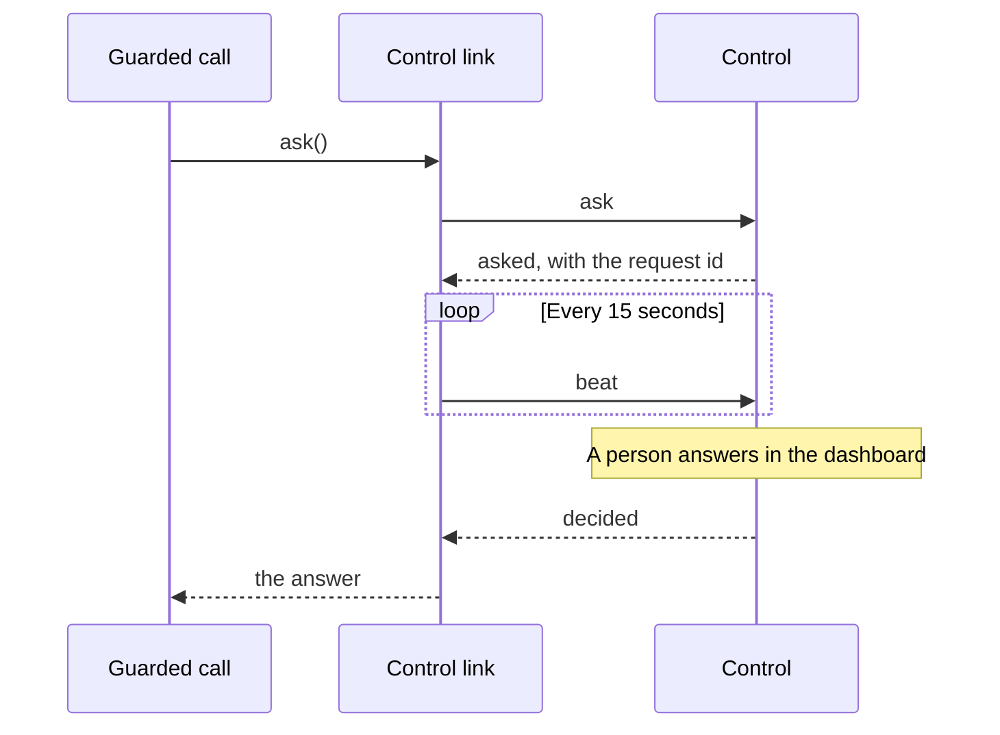

# Uploads and the control link

The SDK talks to the backend in two ways. It uploads events and label records to webhook over HTTP, and it keeps one WebSocket to control for approvals, shared counts, the fleet check and label lookups. Either one gives it the project's hash key. Both are optional, and guards keep working without them. This page covers the code in [`transport/`](https://github.com/oynozan/quard/tree/main/packages/sdk/transport) and the event buffer behind it.

## When uploads and the link start

`quard.configure()` is `configureQuard()` in [`transport/configure.ts`](https://github.com/oynozan/quard/blob/main/packages/sdk/transport/configure.ts):

```ts
// quard.configure() changes settings, then starts uploads and the control link once set up
export function configureQuard(options: Partial<QuardConfig>): void {
    // Checked before anything changes, so a bad call leaves the old settings
    const services = servicesFor({ ...getConfig(), ...options });
    configure(options);
    startUploads(services.uploads);
    startLink(services.link);
}
```

- `servicesFor()` reads `key`, `webhookUrl` and `controlUrl`, merged with earlier calls. With none of them set, nothing starts. Otherwise `key` is required, with `webhookUrl`, `controlUrl` or both. A bad combination throws before any setting changes.
- Uploads run with `key` and `webhookUrl`. They start the event uploader and the label sender. The link runs with `key` and `controlUrl`. Neither takes a hash key: they get the project's key from the backend. See [The project's hash key](#the-projects-hash-key).
- Each start compares the new settings with the running ones. The same settings keep what runs. Changed settings stop it and start a new one. Removed settings stop it.
- The running link is the active control in [`transport/link/active.ts`](https://github.com/oynozan/quard/blob/main/packages/sdk/transport/link/active.ts). Guards reach it with `activeControl()`.
- When uploads start, a `beforeExit` hook sends what is left in the buffer as the process is about to exit.

`stopUploads()` and `stopLink()` stop them. Tests call both through `resetAll()`.

## The project's hash key

The SDK makes every keyed hash with its project's hash key: IBANs and emails, the prints of messages and memory items, and the arguments of an ask. Your app never sets this key. The backend keeps one key for the whole install, `QUARD_HASH_KEY`, which never leaves the server. Webhook and control make each project's key from it with `projectHashKey()` in [`packages/shared/redact/hash.ts`](https://github.com/oynozan/quard/blob/main/packages/shared/redact/hash.ts):

```ts
// The key one project hashes with, derived from the install's key. Projects never share
// hashes, and an agent only ever holds its own project's key, never the install's.
export function projectHashKey(installKey: Buffer, projectId: string): Buffer {
    return createHmac("sha256", installKey).update(`project:${projectId}`).digest();
}
```

The SDK gets its project's key with its agent key, in two ways:

- **From control.** The `ready` message carries it as `hashKey`, 64 lowercase hex characters.
- **From webhook.** A GET to `<webhookUrl>/v1/hash-key` (`HASH_KEY_PATH`), with `authorization: Bearer <key>`, answers 200 with `{ "hashKey": "<64 hex characters>" }`, checked against `hashKeyReply` from [`packages/shared/redact/project-key.ts`](https://github.com/oynozan/quard/blob/main/packages/shared/redact/project-key.ts). A bad or revoked agent key gets 401 with `{ "error": "invalid_agent_key" }`, as on webhook's other routes.

The first answer sets the key, and both give the same one. Until then:

- **Uploads** wait in the buffer. Once the key is known, events are redacted with it and sent. While it can't be had, because webhook is down or refuses the agent key, the uploader tries again as it does for events: the wait doubles up to 60 seconds, and a full buffer drops events and counts them. No raw value ever leaves the process.
- **Label records** go out only with the key. The label sender sends nothing before it, and keeps nothing for later, as when webhook can't store a record.
- **The control link** redacts with the key from `ready`. What it would send before `ready` that needs redaction waits for it.
- **Calls that hash for the backend** wait up to 5 seconds (`KEY_WAIT_MS` in `transport/labels.ts`) for the key first: `quard.inject()`, `quard.resume()`, and reads and writes of a wrapped store. With only uploads on, the wait ends as soon as webhook's answer fails. Without the key, `quard.inject()` stores no record and records `label_record_not_stored`, a write stores no labels, and a read skips the backend lookup.
- **Asks to the dashboard** are built when they are sent, once `ready` has brought the key. So they wait no longer than the usual 30 seconds for control.
- **A refused key request**, such as a 401 for a revoked agent key, warns once per status: `Quard: webhook refused to hand out the hash key (401). Check the agent key and the webhook URL.` A 5xx, 408 or 429 counts as webhook being down, with no warning.
- **Code that only reads the key**, such as `valueHash()` and `printOf()`, works without it while it is unknown: values get no hash, and prints use a random key of the process.

With neither uploads nor the link, the SDK never gets a key, and nothing leaves the process.

## The event buffer

Every event goes through `record()` in [`core/recorder.ts`](https://github.com/oynozan/quard/blob/main/packages/sdk/core/recorder.ts):

```ts
// Matches the backend-down buffer size in PROJECT.md
const MAX_BUFFERED = 10_000;
// ...

// A full buffer drops the oldest allow decision first, then the oldest event
function makeRoom(): void {
    const quiet = buffer.findIndex(isQuiet);
    buffer.splice(Math.max(quiet, 0), 1);
    dropped += 1;
}

export function record(event: RunEvent): void {
    if (buffer.length >= MAX_BUFFERED) {
        makeRoom();
    }
    buffer.push(event);
    try {
        getConfig().onEvent?.(event);
    } catch {
        // A broken event sink must never change what a guarded call does
    }
}
```

- The buffer holds up to 10,000 events. When it is full, the oldest `decision` event with the decision `allow` or `pass` goes first. When there is none, the oldest event goes.
- `dropped` counts what was lost. The next batch reports the number, and `takeDropped()` sets it back to zero.
- `onEvent` from the configuration sees every event at once, with or without uploads. An error it throws is ignored.
- Events go into the buffer even without uploads. Then nothing takes them out, so a long-running process keeps up to 10,000 events in memory.
- The buffer holds at most 32 Mi characters of request bodies, from the `requestBody` of `model_call` events. Past that, the oldest buffered model calls lose their body, and their replay is limited. The wrapped client only adds a body while uploads are on. See [The recorded request](/sdk/internals/monitor#the-recorded-request).

## Uploads to webhook

`createUploader()` in [`transport/uploader.ts`](https://github.com/oynozan/quard/blob/main/packages/sdk/transport/uploader.ts) sends the buffer to webhook:

- **Where.** A POST to `<webhookUrl>/v1/events`, with `authorization: Bearer <key>` and a JSON body.
- **Key first.** No batch goes out before the project's hash key is known. See [The project's hash key](#the-projects-hash-key).
- **Batches.** Up to 500 events (`MAX_BATCH`) at a time, oldest first, split again so a batch stays under 3 MiB as JSON (`MAX_BATCH_BYTES`). An event bigger than that goes alone. Each event gets a new 16-hex `id`, so a batch sent twice is stored once.
- **When.** Every second while webhook answers. After a failure the wait doubles, up to 60 seconds, and goes back to 1 second after a success. The timer is unref'd, so uploads never keep a process alive on their own.
- **Flushes.** `flush()` sends batches until the buffer is empty, and joins a flush already running. It also runs when a call asks for approval through control, so the approver can find the run in the dashboard.
- **Failures.** After a network error, a 5xx, a 408 or a 429, the batch waits for the next try, and its events are marked `degraded`. Any other error status, such as 400 or 401, ends the batch for good, with one warning per status: "Quard: webhook refused events (401). Check the agent key and the webhook URL."
- **Late events.** An event older than 30 seconds when it is sent is marked `degraded: true`.
- **Events JSON can't hold.** An event that can't be turned into JSON, such as one with a `BigInt` in a tool's arguments, is dropped and counted with the dropped events. The first time, the uploader warns: "Quard: dropped events that can't be turned into JSON. Check the arguments of your guarded tools."

The body follows `uploadBatch` in [`packages/shared/events/upload.ts`](https://github.com/oynozan/quard/blob/main/packages/shared/events/upload.ts), which webhook checks every batch against:

```ts
// One event as sent. The id makes a resend harmless; degraded marks
// an event that waited because the backend was down.
export const uploadItem = z.object({
    id: z.string().regex(/^[0-9a-f]{16}$/),
    degraded: z.boolean().optional(),
    event: runEvent,
});

export const uploadBatch = z.object({
    events: z.array(uploadItem).min(1).max(MAX_BATCH),
    // Events the SDK dropped, from a full buffer or because they could not be sent as JSON
    dropped: z.number().int().min(0).optional(),
});
```

### Redaction before upload

`prepareEvent()` in [`transport/prepare.ts`](https://github.com/oynozan/quard/blob/main/packages/sdk/transport/prepare.ts) runs on every event as it goes into a batch:

```ts
// What leaves the process. Tool calls first gain the value keys of their
// arguments, so search can still find them, then everything is redacted.
export function prepareEvent(event: RunEvent, redactor: Redactor): RunEvent {
    if (event.type !== "tool_call") {
        return redactEvent(redactor, event);
    }
    const keys = [...new Set(extractValues(keyText(event.arguments)).flatMap((value) => value.keys))];
    return redactEvent(redactor, { ...event, keys });
}
```

The keys come from `keyText()`, so values under fields named like secrets never become keys.

The redactor from `createRedactor()` in [`packages/shared/redact/redactor.ts`](https://github.com/oynozan/quard/blob/main/packages/shared/redact/redactor.ts), made with the project's hash key, does the work:

- **Every string.** Secrets are removed, and IBANs, card numbers and emails become masks: `DE89…3000`, `4111…1111` and `j…@acme.com`. A key keeps only its known prefix, such as `sk-proj-…`.
- **Secret fields.** Fields named like `password`, `api_key`, `token` or `authorization` lose their whole value.
- **Deep values.** Anything nested 32 levels deep or more is cut.
- **Value keys.** IBAN and email keys become a mask and a keyed hash, such as `iban:DE89…3000#<hash>`. The hash is HMAC-SHA-256 with the project's hash key, cut to 32 hex characters, so the same value always gives the same hash in one project.

Guards see real values in memory. Only what leaves the process is redacted. That includes the `requestBody` a model call carries for replay. Webhook runs `redactEvent()` again before it stores anything, so an old or broken SDK never stores a raw value.

## Label records to webhook

`quard.inject()` and writes to a wrapped store save a [label record](/sdk/internals/labels#label-records). A receiver in another process may look it up at once, so records don't wait for the next batch. `createLabelSender()` in [`transport/label-sender.ts`](https://github.com/oynozan/quard/blob/main/packages/sdk/transport/label-sender.ts) sends them right away:

- **Where.** A POST to `<webhookUrl>/v1/labels` (`LABELS_PATH`), with the same `authorization` header as uploads.
- **Key first.** Records wait until the project's hash key is known, as events do.
- **What.** Up to 100 records per request, each redacted with `redactRecord()` from [`packages/shared/redact/record.ts`](https://github.com/oynozan/quard/blob/main/packages/shared/redact/record.ts) and checked against `labelUpload`. Names, origins and flags are redacted. Hashes and ids stay as they are.
- **Done.** Only HTTP 201 counts as stored. Each request waits up to 5 seconds (`STORE_MS`).
- **No retry.** A record that wasn't stored is not sent again. `storeLabels()` in [`transport/labels.ts`](https://github.com/oynozan/quard/blob/main/packages/sdk/transport/labels.ts) returns `false`, and the caller decides what that means. See [Agents, messages and memory](/sdk/internals/multi-agent).

With uploads off, `sendLabels()` returns `false` at once.

## The control link

### One WebSocket

- `controlSocketUrl()` in [`link/url.ts`](https://github.com/oynozan/quard/blob/main/packages/sdk/transport/link/url.ts) turns `controlUrl` into the socket address: `http` becomes `ws`, `https` becomes `wss`, and `/v1/connect` is added to the path. Any other scheme throws.
- `openSocket()` in [`link/socket.ts`](https://github.com/oynozan/quard/blob/main/packages/sdk/transport/link/socket.ts) opens it with the `ws` package and `authorization: Bearer <key>`. Messages are JSON text. A message from control may be up to 64 MB, since a `ready` message can carry a long quarantine list.
- `createLink()` in [`link/link.ts`](https://github.com/oynozan/quard/blob/main/packages/sdk/transport/link/link.ts) keeps the connection up. It sends `hello` when the socket opens and waits up to 10 seconds for `ready`. Control pings every 30 seconds, so 75 seconds of silence drops the connection. After a drop it tries again after 1 second, and doubles the wait each time, up to 15 seconds.
- `send()` sends only while the link is ready, and never a message over 1 MB, because control drops connections that send more. It returns `false` when a message can't go out.
- When control refuses the key, with HTTP 401 on connect or the close code 4401, the link warns once: "Quard: control refused the agent key. Check that the key is valid and not revoked." It keeps trying.
- The socket and its retry timer are unref'd, so the link never keeps your app alive by itself. `hold()` refs them while a call waits on control, such as an approval or a count, and lets go when the call is done.

### Messages

The message formats are Zod schemas in [`packages/shared/control/protocol.ts`](https://github.com/oynozan/quard/blob/main/packages/shared/control/protocol.ts), with lookups and run counts in [`packages/shared/control/labels.ts`](https://github.com/oynozan/quard/blob/main/packages/shared/control/labels.ts). The SDK reads control's messages with `serverMessage`, and ignores any that fail it. Control reads the SDK's with `clientMessage`.

| From the SDK | When                                                            | What it holds                                                                |
| ------------ | --------------------------------------------------------------- | ---------------------------------------------------------------------------- |
| `hello`      | First, on every connection                                      | The SDK version, host name, process id and the rules snapshot                |
| `rules`      | The active rules changed                                        | The rules snapshot: a hash, and a list of tool, guard, rule and mode         |
| `agent`      | An agent version is new to this process, and after each connect | The agent, version, model, tool names and redacted instructions              |
| `ask`        | A call needs a person                                           | See [Approvals](#approvals)                                                  |
| `beat`       | Every 15 seconds while calls wait                               | The ask ids still waiting                                                    |
| `cancel`     | A waiting call stops, after its timeout                         | The ask id                                                                   |
| `count`      | A call adds to a per-day counter                                | The tool, counter, UTC day, amount to add and an optional cap                |
| `uncount`    | A counted call was refused after all                            | The tool, UTC day and the counts to take back                                |
| `fleet`      | A call uses fleet-watched values                                | The run, agent and tool, whether the call was blocked, and up to 100 values  |
| `lookup`     | A receiver or a memory read needs a label record                | A message's label reference, or a memory item's print                        |
| `run_count`  | A run that spans processes adds to its counters                 | The run id, and up to 20 counters with the amount to add and an optional cap |

| From control   | When                        | What it holds                                                                                                                |
| -------------- | --------------------------- | ---------------------------------------------------------------------------------------------------------------------------- |
| `ready`        | Answers `hello`             | The time, the quarantine list, the end of the fleet check's observe days, today's per-day counts, and the project's hash key |
| `asked`        | Control stored an ask       | The ask id and the approval request id                                                                                       |
| `decided`      | The ask was answered        | The ask id, the answer (`once`, `always` or `deny`), the request id, and a grant id when a standing grant answered           |
| `counted`      | Answers `count`             | Whether the amount was added, and the counter's total                                                                        |
| `run_counted`  | Answers `run_count`         | Whether the amounts were added, and each counter's total                                                                     |
| `labels`       | Answers `lookup`            | Up to 20 label records: at most one for a message, one per distinct label for a memory item, least trusted first             |
| `fleet_result` | Answers `fleet`             | The call's values that are quarantined now, and the end of the observe days                                                  |
| `quarantine`   | The quarantine list changed | Keys to add and keys to remove                                                                                               |
| `error`        | A message failed            | A code, a message, and the id of the request it answers                                                                      |

### Hello and ready

`createControl()` in [`link/control.ts`](https://github.com/oynozan/quard/blob/main/packages/sdk/transport/link/control.ts) builds the link and its parts. The hello carries the rules, so control knows them from the start:

```ts
const link = createLink({
    // ...
    hello: () => {
        const rules = rulesSnapshot();
        sentRules = rules.hash;
        return { type: "hello", sdk: SDK_VERSION, host: hostname().slice(0, 255), pid: process.pid, rules };
    },
});
```

On each `ready`, after the first connect and after every reconnect:

- the project's hash key it carries becomes the key the link redacts and hashes with, and the SDK's key if webhook hasn't given it yet,
- today's per-day counts from control go into the local day counts, where the larger total wins,
- every agent version this process knows is sent again,
- the synced quarantine list is replaced, and the end of the fleet check's observe days is set,
- asks still waiting are sent again,
- counts, counts to take back, fleet reports and shared-run counts that control missed are sent,
- lookups made before the first connect are sent.

### Rules and agent versions

- `rulesSnapshot()` in [`policy/rules.ts`](https://github.com/oynozan/quard/blob/main/packages/sdk/policy/rules.ts) lists every guarded tool's rules by the names their decisions use, with the tool, guard and mode. A tool in the policy file uses the file's options. The five run limit rules come first, once for the whole run, under the tool `*` and in the run limits' mode. The hash also covers the options themselves, the policy version, the strictness, the signature feed's mode and the run limits. Functions count by their name.
- `syncRules()` sends a `rules` message when the hash changed since control last saw it. `guard()` calls it when it wraps a tool, and `runPipeline()` before every call, so an edit to the policy file reaches control with the next call.
- `sendAgent()` sends an `agent` message with redacted instructions, cut to 100,000 characters.

### Approvals

`createApprovals()` in [`link/approvals.ts`](https://github.com/oynozan/quard/blob/main/packages/sdk/transport/link/approvals.ts) keeps the calls that wait for a person.



`askFor()` in `pipeline/approval/message.ts` builds the ask and checks it against `askMessage` from the protocol:

```ts
// A call that needs a human. Sent again with requestId after a reconnect.
export const askMessage = z.object({
    type: z.literal("ask"),
    askId: id,
    requestId: requestId.optional(),
    runId,
    stepId,
    agent: name,
    tool: name,
    // Keyed hash of the canonical arguments, secrets included
    argsHash: hex(32),
    // Full values with secrets removed, for the approver
    args: z.unknown(),
    labels: z.array(argumentLabel).max(500),
    context: z.object({ trust, sensitivity, origins: z.array(z.string().max(2000)).max(200), flagged: z.boolean() }),
    reasons: z.array(askReason).min(1).max(50),
    rules: hex(16).optional(),
});
```

- **Taken.** Control answers `asked` with an approval request id. From then on the call waits with no time limit, unless the approval guard sets a `timeout`.
- **Heartbeats.** One timer sends a `beat` with every waiting ask id every 15 seconds (`APPROVAL_BEAT_MS`). The dashboard shows a request with no beat for 45 seconds as no longer waiting.
- **Timeout.** When the guard's `timeout` passes, the SDK sends `cancel` and refuses the call with `approval_timed_out`.
- **Aborted.** When the call's abort signal fires, the SDK sends `cancel` too, so no one approves a call that is gone. See [Aborted calls](/sdk/internals/pipeline#aborted-calls).
- **Reconnects.** After a reconnect, each waiting ask is sent again with its request id, so control matches it to the same request.
- **Control away.** Control must take an ask within 30 seconds (`downMs`), and take it again within 30 seconds after the link drops. Otherwise the call is refused with `backend_unavailable`. When control answers an ask with `error`, the ask is sent again after 1 second.
- **Holding.** Each waiting call holds the link, so the process stays alive until the answer comes.

The answer goes back to `askControl()` in `pipeline/approval/remote.ts`, which records it. See [Approval](/sdk/internals/pipeline#approval) in the pipeline.

### Counts, fleet reports and lookups

- **Requests.** `createRequests()` in [`link/requests.ts`](https://github.com/oynozan/quard/blob/main/packages/sdk/transport/link/requests.ts) matches `counted`, `run_counted`, `fleet_result` and `labels` replies to their requests by id. A request waits up to 5 seconds (`replyMs`). It gives up at once when the message can't be sent, when control answers `error`, or when the link drops. The caller then falls back.
- **Lookups at start.** A process that just started may get a message before its link is up. So `lookupLabels()` in [`transport/labels.ts`](https://github.com/oynozan/quard/blob/main/packages/sdk/transport/labels.ts) sets `waitForStart`: before the first connect, the lookup waits up to `replyMs` for it and is sent on `ready`. Without an answer, the caller gets `undefined`.
- **Late replies.** A reply that comes after the wait still reaches a `late` handler. So a count that control did make after all is not sent again.
- **Per-day counts.** With the link ready, `countDays()` sends a `count` with the smallest enforced cap as `max`. Control adds only when the total stays within it, and answers with the total. Without an answer, the SDK counts in the process and keeps the count to send later.
- **Taking counts back.** When a call is refused after control counted it, `takeBack()` sends `uncount`. When the message can't go out, the amount is owed and taken back on the next `ready`.
- **Fleet reports.** `reportUse()` sends a call's watched values, up to 100 per report: IBANs and emails as a mask and a keyed hash, domains in clear. A refused call is reported too, marked `blocked`.
- **Replays.** `createReplays()` in [`link/queue.ts`](https://github.com/oynozan/quard/blob/main/packages/sdk/transport/link/queue.ts) keeps what control missed: counts, summed by day, tool and counter, and up to 1,000 fleet reports. It sends them on the next `ready`. What it keeps while the link is up is tried again after 30 seconds. Replayed counts have no cap, because those calls already ran.

### Runs that span processes

Once `quard.inject()` or `quard.resume()` carries a run to another process, its steps, cost and per-run limit counters live in control. `startSharing()` in [`context/shared-run.ts`](https://github.com/oynozan/quard/blob/main/packages/sdk/context/shared-run.ts) marks the run shared and sends what this process counted so far:

```ts
export function startSharing(run: RunState): void {
    const control = activeControl();
    if (control === undefined || !isRunId(run.runId) || !markShared(run)) {
        return;
    }
    control.runs.send(run, runTotals(run));
}
```

- Without a link, the run is not marked. It keeps counting in the process, and the next `quard.inject()` tries again.
- Counters are named as control names them: `steps`, `cost`, `calls:<tool>` and `amount:<tool>:<field>`. A name longer than 200 characters stays in the process.
- `run_count` adds all of its counters or none, like `count` does for a day. With `max`, control adds only while the run's total stays within it.
- A run's totals only grow, so the larger of the local and the control total wins.
- `createRunReplays()` in [`link/run-queue.ts`](https://github.com/oynozan/quard/blob/main/packages/sdk/transport/link/run-queue.ts) keeps what control missed: counts summed by run and counter, for up to 1,000 runs. It sends them on the next `ready`, and tries again after 30 seconds while the link is up. Replayed counts have no cap.

See [Runs across processes](/concepts/run-limits#runs-across-processes) for what this means for the limits.

### The quarantine list

`createFleetState()` in [`link/quarantine.ts`](https://github.com/oynozan/quard/blob/main/packages/sdk/transport/link/quarantine.ts) keeps the synced copy that the fleet check reads before each call:

- `ready` replaces the list and sets the end of the fleet check's observe days.
- `quarantine` messages add and remove keys while the link is up.
- `fleet_result` replies add the call's quarantined values.
- Once the link has been down for more than 24 hours (`staleMs`), the copy is cleared.
- Before the observe days end, a quarantined value is only recorded as "would block". So is an entry control quarantined during those days.

## When the backend is down

This is how the code carries out [When Quard's backend is down](/concepts/guards#when-quards-backend-is-down):

| Part                                       | What the code does                                                                                                                                                                                                                                                                                                                                         |
| ------------------------------------------ | ---------------------------------------------------------------------------------------------------------------------------------------------------------------------------------------------------------------------------------------------------------------------------------------------------------------------------------------------------------- |
| Rules, value labels, per-run limits, scans | Run in your process, with no backend.                                                                                                                                                                                                                                                                                                                      |
| Approvals and any ask                      | An `approver` set in code answers as usual. Through control, the call waits up to 30 seconds for control to take the ask, then is refused with `backend_unavailable`. With neither, it is refused at once with `approval_unavailable`.                                                                                                                     |
| Per-day limits                             | Counted in the process, from the last totals control sent. A call is blocked once the local total would pass the cap. The counts go to control when it is back.                                                                                                                                                                                            |
| Fleet check and quarantine list            | The last synced list is used for up to 24 hours. Reports wait in the replay queue.                                                                                                                                                                                                                                                                         |
| Labels                                     | Labels live in the process. History this process never saw counts as untrusted.                                                                                                                                                                                                                                                                            |
| Label records                              | A message whose record wasn't stored records a `label_record_not_stored` warning. A receiver whose lookup finds nothing in time reads the message as untrusted. `quard.resume()` then records `label_record_not_found`, and the agent counts as past the depth limit. A memory item read with no labels counts as untrusted, unless this process wrote it. |
| Runs that span processes                   | Steps, cost and per-run counts are counted in the process, from the last totals control sent, and sent when control is back.                                                                                                                                                                                                                               |
| Detector                                   | Not part of the backend. A detector error or timeout records a `detector_error` warning, and the content stays as the rules left it.                                                                                                                                                                                                                       |
| Event records                              | Kept in the buffer, up to 10,000, and retried every 1 to 60 seconds. A full buffer drops allow decisions first, and the next batch says how many. Events sent late carry `degraded: true`.                                                                                                                                                                 |
| Project hash key                           | Not known until webhook or control answers. Uploads wait for it, and webhook is asked again with a wait that doubles up to 60 seconds. Calls that hash for the backend wait up to 5 seconds, then go on without storing or looking up labels. No raw value leaves the process.                                                                             |

## Source

- [`packages/sdk/transport/configure.ts`](https://github.com/oynozan/quard/blob/main/packages/sdk/transport/configure.ts): when uploads and the link start and stop
- [`packages/sdk/core/recorder.ts`](https://github.com/oynozan/quard/blob/main/packages/sdk/core/recorder.ts): the event buffer
- [`packages/sdk/transport/uploader.ts`](https://github.com/oynozan/quard/blob/main/packages/sdk/transport/uploader.ts): batches and retries
- [`packages/sdk/transport/prepare.ts`](https://github.com/oynozan/quard/blob/main/packages/sdk/transport/prepare.ts): value keys and redaction before upload
- [`packages/sdk/transport/label-sender.ts`](https://github.com/oynozan/quard/blob/main/packages/sdk/transport/label-sender.ts): label records to webhook
- [`packages/sdk/transport/labels.ts`](https://github.com/oynozan/quard/blob/main/packages/sdk/transport/labels.ts): `storeLabels()` and `lookupLabels()`
- [`packages/sdk/context/shared-run.ts`](https://github.com/oynozan/quard/blob/main/packages/sdk/context/shared-run.ts): runs that span processes
- [`packages/sdk/transport/link`](https://github.com/oynozan/quard/tree/main/packages/sdk/transport/link): the WebSocket to control and everything that uses it
- [`packages/shared/control/protocol.ts`](https://github.com/oynozan/quard/blob/main/packages/shared/control/protocol.ts): the message formats
- [`packages/shared/control/labels.ts`](https://github.com/oynozan/quard/blob/main/packages/shared/control/labels.ts): lookups and run counts
- [`packages/shared/control/constants.ts`](https://github.com/oynozan/quard/blob/main/packages/shared/control/constants.ts): heartbeat timing and fleet check settings
- [`packages/shared/events/upload.ts`](https://github.com/oynozan/quard/blob/main/packages/shared/events/upload.ts): the upload format
- [`packages/shared/labels/records.ts`](https://github.com/oynozan/quard/blob/main/packages/shared/labels/records.ts): the label record and label upload formats
- [`packages/shared/redact`](https://github.com/oynozan/quard/tree/main/packages/shared/redact): redaction, the keyed hash, each project's hash key, and the hash key request
