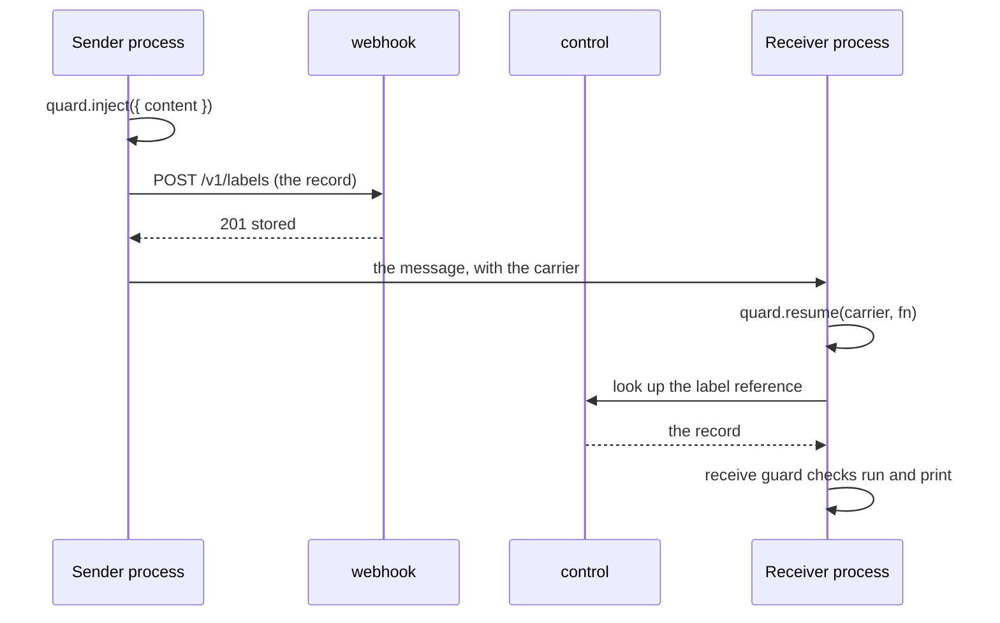

# Messages between agents

When one agent sends work to another, three calls keep the run and its labels together: `quard.inject()` on the sending side, `quard.resume()` on the receiving side, and `quard.toBaggage()` to put the carrier in an HTTP header. A source guard with origin `"agent"` reads the message and gives it the labels the sender stored. [Multi-agent](/concepts/multi-agent) explains the idea. This page gives the API.

```ts
type Carrier = {
    runId: string;
    parentStepId?: string;
    labelRef: string;
};

type InjectOptions = { content: unknown };
type ResumeOptions = { agent?: string; tools?: string[] };

// quard.inject, quard.toBaggage and quard.resume
function inject(options: InjectOptions): Promise<Carrier>;
function toBaggage(carrier: Carrier): string;
function resume<T>(carrier: unknown, fn: () => T, options?: ResumeOptions): Promise<Awaited<T>>;
```

`Carrier`, `InjectOptions` and `ResumeOptions` are exported as types from `quard`.

## The carrier

| Field          | Format                       | What it is                                                                          |
| -------------- | ---------------------------- | ----------------------------------------------------------------------------------- |
| `runId`        | 32 hex characters            | The run the message belongs to                                                      |
| `parentStepId` | 16 hex characters, or absent | The sender's latest step. Absent when the sending agent has made no step yet        |
| `labelRef`     | 16 hex characters            | The label reference: the key of the [label record](#label-records) for this message |

Put the carrier in the slot your channel has for metadata: the `baggage` header for HTTP, `_meta` for MCP, `metadata` for A2A, or message attributes for a queue.

## quard.inject()

Stores the labels of a message and returns its carrier. Call it inside the run, with the exact content you send.

| Option    | Type      | What it does                                                                                                                                          |
| --------- | --------- | ----------------------------------------------------------------------------------------------------------------------------------------------------- |
| `content` | `unknown` | The message as you send it. A string or any JSON value. The receive function must return the same value, see [Verified messages](#verified-messages). |

What it does:

1. Makes a new label reference.
2. Builds the label record from the run as it is now. See [Label records](#label-records).
3. Keeps the record in this process, so a `quard.resume()` here finds it without the backend.
4. Marks the run as one that spans processes. With the control link on, its steps, cost and per-run limit counts move to `control`. See [Run limits](/sdk/reference/run-limits#runs-across-processes).
5. When uploads or the control link are on, it sends the record to `webhook` and waits until it is stored, for up to 5 seconds. If it isn't stored, for example because uploads are off or `webhook` didn't answer, Quard records a `label_record_not_stored` warning. A receiver in another process will then read the message as untrusted.
6. Returns the carrier.

It returns a promise, so await it. With no current run, it throws `quard.inject() must be called inside quard.run()`.

The send function is a tool like any other. Wrap it with a [limit guard](/sdk/reference/limit-guard) with [`delegateTo`](/sdk/reference/run-limits#delegateto) so the run limits check depth, fan-out and loops.

## quard.toBaggage()

Turns a carrier into W3C baggage list members, for the HTTP `baggage` header:

```text
quard-run=<runId>,quard-parent=<parentStepId>,quard-labels=<labelRef>
```

- Each value is percent-encoded. `quard-parent` is left out when the carrier has no `parentStepId`.
- If the request already has a `baggage` header, join the two with a comma.
- `quard.resume()` reads a whole header back. It ignores other members and member properties, and takes the first of each `quard-` member.

## quard.resume()

Runs `fn` inside the run the carrier names, as the agent you name. It returns a promise of what `fn` returns.

| Parameter       | Type       | Default     | What it does                                                                                      |
| --------------- | ---------- | ----------- | ------------------------------------------------------------------------------------------------- |
| `carrier`       | `unknown`  | required    | A `Carrier` object, or a whole `baggage` header string                                            |
| `fn`            | `() => T`  | required    | The work to do inside the run                                                                     |
| `options.agent` | `string`   | `"default"` | The receiving agent's name                                                                        |
| `options.tools` | `string[]` | none        | The guarded tools this agent may use. It can only narrow what the sender may use, never add to it |

### With a carrier Quard can read

A carrier is readable when `runId` is 32 hex characters, `labelRef` is a string, and `parentStepId` is absent or 16 hex characters.

1. Quard looks up the label record: first in this process, then through `control`. The lookup waits for the control link to start and for an answer, for up to 5 seconds.
2. The record counts only when it belongs to the carrier's run.
3. When this process sent a message in that run, `fn` rejoins that same run, with everything it read. Otherwise it runs in a new run object with the carrier's run id. With the control link on, that run counts its steps, cost and per-run limits through `control`.
4. `fn` runs as the named agent, with the sender's step as its parent step.

| The record is | The agent's tools                               | The agent's depth                                                |
| ------------- | ----------------------------------------------- | ---------------------------------------------------------------- |
| Found         | The sender's tools, narrowed by `options.tools` | The sender's depth plus one                                      |
| Not found     | `options.tools` only                            | Past any depth limit, so it can't delegate once run limits block |

When the record is not found, Quard also records a `label_record_not_found` warning.

The run started in another process, so `quard.resume()` records no `run_started` or `run_finished` event.

### With a carrier Quard can't read

A missing or broken carrier, such as `undefined` or a header without `quard-` members, starts a new run, as `quard.run({ agent, tools })` would. That run's start and end are recorded. A receive guard in it reads messages as `agent:unknown`, unless its `carrierOf` finds a carrier.

## The receive guard

The function that reads incoming messages gets a [source guard](/sdk/reference/source-guard) whose `origin` is exactly `"agent"`:

```ts
const receive = guard(rawReceive, { type: "source", origin: "agent", name: "receive" });
```

| Option      | Type                          | Default | What it does                                                                                                                  |
| ----------- | ----------------------------- | ------- | ----------------------------------------------------------------------------------------------------------------------------- |
| `origin`    | `"agent"`                     |         | Makes the source guard a receive guard                                                                                        |
| `carrierOf` | `(input: unknown) => unknown` | none    | Gets the receive function's input and returns the message's carrier: a `Carrier` object or a baggage header string. Code only |

- Without `carrierOf`, or when it returns `undefined` or `null`, the guard uses the carrier that `quard.resume()` came in with.
- Use `carrierOf` when each message brings its own carrier, such as in queue attributes.
- `originOf` is ignored. The origin is `agent:<sender>`, from the label record, or `agent:unknown`.
- A full origin such as `"agent:billing"` makes a plain source guard that looks up nothing.
- A policy file entry for the receive tool replaces its options from code, `carrierOf` included.
- After the label, the guard works like any source guard: the domain check, the scan, `onSuspect`, the signature feed and the detector.

### Verified messages

A message is verified when all of these hold:

- A label record was found for its carrier.
- The record belongs to the carrier's run.
- The record's print matches what the receive function returned. The print is a keyed hash of the whole value, as JSON with sorted keys. So the receive function must return exactly the `content` given to `quard.inject()`. A string that changed by one hidden character doesn't match.

| The message is | Origin                              | Trust and sensitivity                                                                                          | Values in it                                                               |
| -------------- | ----------------------------------- | -------------------------------------------------------------------------------------------------------------- | -------------------------------------------------------------------------- |
| Verified       | `agent:<sender>`                    | From the record. A team's [origin override](/sdk/reference/configure#origins) for that exact origin still wins | Each traced value comes in first with the label it had in the sender's run |
| Not verified   | `agent:<sender>` or `agent:unknown` | `untrusted` and `internal`, the default for agents. Overrides don't apply                                      | They take the message's label                                              |

In a verified, trusted message, a value the record doesn't vouch for was written by the sender's model. It stays [model-generated](/concepts/value-tracing#model-generated-values) for the rest of the run, so later output from your own tools doesn't make it seen.

### The message event

Each message the receive guard reads records a `message` event:

| Field                  | What it holds                                               |
| ---------------------- | ----------------------------------------------------------- |
| `agent`                | The receiving agent                                         |
| `stepId`               | The receive call's step                                     |
| `from`                 | The sender, or `unknown` when the message is not verified   |
| `parentStepId`         | The sender's step, from the carrier                         |
| `labelRef`             | The label reference, when the carrier had a well-formed one |
| `verified`             | Whether the message is [verified](#verified-messages)       |
| `trust`, `sensitivity` | The message's label after the source guard                  |

The run page draws these as links between agents in the [run graph](/guides/runs#the-run-graph).

## Label records

A label record is what the sender stores so the receiver can label the message. It never holds the message text.

| Field    | What it holds                                                                                                                       |
| -------- | ----------------------------------------------------------------------------------------------------------------------------------- |
| `ref`    | The label reference                                                                                                                 |
| `runId`  | The sender's run                                                                                                                    |
| `stepId` | The sender's latest step, if any                                                                                                    |
| `sender` | The sending agent's name                                                                                                            |
| `depth`  | The sending agent's delegation depth                                                                                                |
| `print`  | A keyed hash of the whole content, made with your project's hash key                                                                |
| `label`  | The sender run's [context label](/concepts/labels#the-context-label): trust, sensitivity, origins, and whether anything was flagged |
| `values` | Each traced value in the content, as a keyed hash, with the origin, trust, sensitivity and flags it had where it first appeared     |
| `tools`  | The guarded tools the sender may use, when its list is limited                                                                      |

- A sender run that has read nothing can't say where the content came from. Its record carries the label for unknown content: untrusted and internal.
- A value counts only when the value itself appeared earlier in the run. A value the sender's model made up is not in the record.
- Raw values never leave the process. Each one goes by a keyed hash.

### How the receiver gets them



- The sender stores records through uploads: `key` and `webhookUrl`.
- The receiver looks them up through the control link: `key` and `controlUrl`.
- Set up both sides with all three, and agent keys from the same project. Each project hashes with its own key, so only then do the prints and value hashes match.
- With a backend set, `quard.inject()` and `quard.resume()` first wait for your project's hash key. See [The hash key](/sdk/reference/configure#the-hash-key).
- In one process, no backend is needed: the process keeps up to 10,000 of its own records.

## Warnings

| Code                      | Recorded by      | When                                                                                                                                          |
| ------------------------- | ---------------- | --------------------------------------------------------------------------------------------------------------------------------------------- |
| `label_record_not_stored` | `quard.inject()` | Uploads or the control link are on, but the record wasn't stored: uploads are off, `webhook` refused it, or it didn't answer within 5 seconds |
| `label_record_not_found`  | `quard.resume()` | No record of the carrier's run was found for its label reference                                                                              |

## Example

The sender delegates over HTTP:

```ts
import { guard, quard } from "quard";

const delegate = guard(
    async (input: { to: string; brief: string }) => {
        const carrier = await quard.inject({ content: input.brief });
        const response = await fetch(`https://${input.to}.internal/tasks`, {
            method: "POST",
            headers: { "content-type": "application/json", baggage: quard.toBaggage(carrier) },
            body: JSON.stringify({ brief: input.brief }),
        });
        return response.text();
    },
    { type: "limit", name: "delegate", delegateTo: "to" },
);
```

The receiver answers inside the same run:

```ts
let brief = "";
const readMessage = guard(async () => brief, { type: "source", origin: "agent", name: "readMessage" });

server.on("request", async (request, response) => {
    brief = JSON.parse(await readBody(request)).brief;
    const answer = await quard.resume(request.headers.baggage, () => billingAgent({ readMessage, payInvoice }), {
        agent: "billing",
    });
    response.end(answer);
});
```

`readMessage` returns the brief exactly as `quard.inject()` got it, so the message is verified. An IBAN in it that came from a web page in the sender's run still reads as `web:…`.

## Related

- [Multi-agent](/concepts/multi-agent): one run across agents and processes, and what travels with a message.
- [22. Agents in two processes](/sdk/examples/agents-in-two-processes): this example, end to end.
- [Run limits](/sdk/reference/run-limits): depth, fan-out and loops on the delegate tool.
- [Multi-agent internals](/sdk/internals/multi-agent): how the code is laid out.

## Source

- [`packages/sdk/context/carrier.ts`](https://github.com/oynozan/quard/blob/main/packages/sdk/context/carrier.ts): `Carrier`, `InjectOptions`, `ResumeOptions`, `inject()` and `resume()`
- [`packages/sdk/context/baggage.ts`](https://github.com/oynozan/quard/blob/main/packages/sdk/context/baggage.ts): `toBaggage()` and `readBaggage()`
- [`packages/sdk/guards/source/source.ts`](https://github.com/oynozan/quard/blob/main/packages/sdk/guards/source/source.ts): `receiveMessage()`, which decides if a message is verified
- [`packages/sdk/pipeline/output.ts`](https://github.com/oynozan/quard/blob/main/packages/sdk/pipeline/output.ts): the receive guard and the `message` event
- [`packages/sdk/labels/records.ts`](https://github.com/oynozan/quard/blob/main/packages/sdk/labels/records.ts): `saveRecord()` and `findRecord()`
- [`packages/sdk/labels/message-record.ts`](https://github.com/oynozan/quard/blob/main/packages/sdk/labels/message-record.ts): the record as it is stored
- [`packages/sdk/labels/print.ts`](https://github.com/oynozan/quard/blob/main/packages/sdk/labels/print.ts): `printOf()`, the keyed hash of the content
- [`packages/shared/labels/records.ts`](https://github.com/oynozan/quard/blob/main/packages/shared/labels/records.ts): the label record schemas
